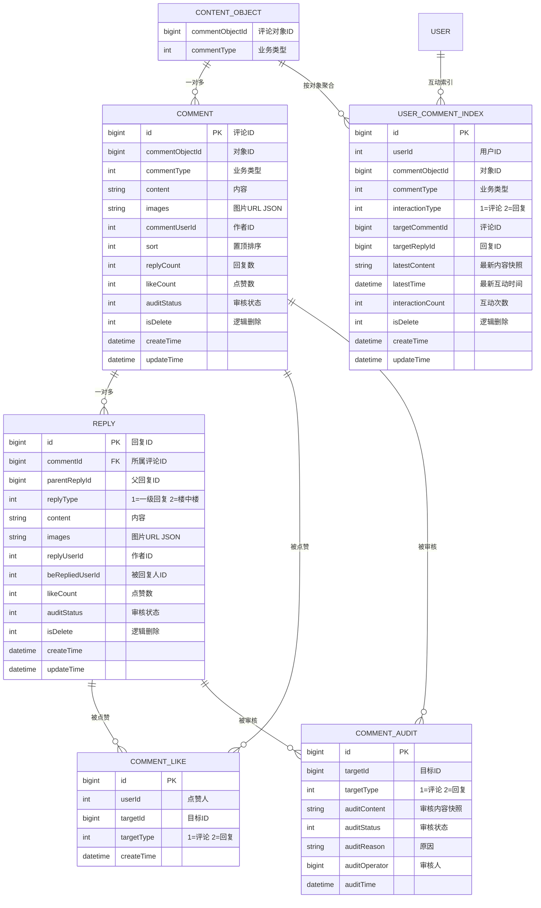

# 领域模型设计

> 本文档面向上游业务方接入与系统讲解，梳理评论中心核心领域实体、关系及数据约束。模型基于现有后端代码（`ssp-comment-center-domain`）与数据库 DDL（`docs/05-database/ddl.sql`）整理。

---

## 一、核心实体关系概览



---

## 二、实体详细说明

### 2.1 评论对象（ContentObject）

- **非数据库实体**，表示被评论的外部内容对象（题解、视频、帖子等）。
- 通过 `commentObjectId + commentType` 唯一标识一个评论场景。
- 示例：`(10001, 1)` 表示 ID 为 10001 的帖子。

### 2.2 一级评论（Comment）

| 字段 | 类型 | 说明 | 约束/索引 |
|------|------|------|----------|
| `id` | BIGINT | 主键，雪花 ID | PRIMARY KEY |
| `commentObjectId` | BIGINT | 评论对象 ID | 分库键（comment_type）/ 分表键（comment_user_id） |
| `commentType` | INT | 业务类型（1=帖子、2=视频等） | 复合索引 `idx_object` |
| `content` | TEXT | 评论内容 | 非空 |
| `images` | VARCHAR(2000) | 图片 URL JSON | 默认 `'[]'` |
| `commentUserId` | INT | 评论作者 ID | 索引 `idx_user` |
| `sort` | INT | 置顶排序，越大越靠前 | 默认 0 |
| `replyCount` | INT | 回复数冗余 | 默认 0，通过 `greatest(delta, 0)` 保证非负 |
| `likeCount` | INT | 点赞数冗余 | 默认 0 |
| `auditStatus` | INT | 0=待审核 1=通过 2=拒绝 | 默认 0 |
| `isDelete` | TINYINT | 0=正常 1=删除 | 默认 0，逻辑删除 |
| `createTime` | DATETIME | 创建时间 | 默认 CURRENT_TIMESTAMP |
| `updateTime` | DATETIME | 更新时间 | 默认 CURRENT_TIMESTAMP ON UPDATE |

**索引**：
- `PRIMARY KEY (id)`
- `INDEX idx_object (comment_object_id, comment_type, is_delete)`
- `INDEX idx_user (comment_user_id, is_delete)`

### 2.3 回复（Reply）

| 字段 | 类型 | 说明 | 约束/索引 |
|------|------|------|----------|
| `id` | BIGINT | 主键，雪花 ID | PRIMARY KEY |
| `commentId` | BIGINT | 所属一级评论 ID | FK 逻辑关联 Comment.id，分库分表键 |
| `parentReplyId` | BIGINT | 父回复 ID，0 表示直接回复评论 | 默认 0 |
| `replyType` | INT | 1=一级回复，2=楼中楼回复 | 默认 1 |
| `content` | TEXT | 回复内容 | 非空 |
| `images` | VARCHAR(2000) | 图片 URL JSON | 默认 `'[]'` |
| `replyUserId` | INT | 回复作者 ID | 索引 `idx_user` |
| `beRepliedUserId` | INT | 被回复用户 ID | 默认 -1 |
| `likeCount` | INT | 点赞数冗余 | 默认 0 |
| `auditStatus` / `isDelete` | INT / TINYINT | 同 Comment | 默认 0 |
| `createTime` / `updateTime` | DATETIME | 同 Comment | - |

**索引**：
- `PRIMARY KEY (id)`
- `INDEX idx_comment (comment_id, parent_reply_id, is_delete)`
- `INDEX idx_user (reply_user_id, is_delete)`

### 2.4 点赞记录（CommentLike）

采用**统一目标模型**：`targetId + targetType` 同时覆盖评论和回复。

| 字段 | 类型 | 说明 | 约束/索引 |
|------|------|------|----------|
| `id` | BIGINT | 主键 | PRIMARY KEY |
| `userId` | INT | 点赞用户 ID | 分库分表键 |
| `targetId` | BIGINT | 目标 ID | - |
| `targetType` | INT | 1=评论，2=回复 | - |
| `createTime` | DATETIME | 点赞时间 | - |

**索引**：
- `PRIMARY KEY (id)`
- `UNIQUE INDEX uk_user_target (user_id, target_id, target_type)` —— 防重复点赞
- `INDEX idx_target (target_id, target_type)` —— 按目标反查点赞人

### 2.5 审核记录（CommentAudit）

同样采用统一目标模型，单表存储于默认库，不分片。

| 字段 | 类型 | 说明 | 约束/索引 |
|------|------|------|----------|
| `id` | BIGINT | 主键 | PRIMARY KEY |
| `targetId` | BIGINT | 目标 ID | - |
| `targetType` | INT | 1=评论，2=回复 | - |
| `auditContent` | VARCHAR(500) | 审核内容快照 | - |
| `auditStatus` | INT | 审核结果 | 非空 |
| `auditReason` | VARCHAR(500) | 拒绝原因 | - |
| `auditOperator` | BIGINT | 审核人 | 默认 0 |
| `auditTime` | DATETIME | 审核时间 | - |

**索引**：
- `PRIMARY KEY (id)`
- `INDEX idx_target (target_id, target_type)`

### 2.6 用户评论索引（UserCommentIndex）

用于支撑「我评论过哪些」这类**用户维度反查**。

| 字段 | 类型 | 说明 | 约束/索引 |
|------|------|------|----------|
| `id` | BIGINT | 主键 | PRIMARY KEY |
| `userId` | INT | 用户 ID | 分库分表键 |
| `commentObjectId` | BIGINT | 评论对象 ID | - |
| `commentType` | INT | 业务类型 | - |
| `interactionType` | INT | 1=评论，2=回复 | - |
| `targetCommentId` | BIGINT | 关联评论 ID | - |
| `targetReplyId` | BIGINT | 关联回复 ID（可选） | - |
| `latestContent` | VARCHAR(500) | 最新内容快照 | - |
| `latestTime` | DATETIME | 最近互动时间 | - |
| `interactionCount` | INT | 累计互动次数 | 默认 1 |
| `isDelete` | TINYINT | 逻辑删除 | 默认 0 |
| `createTime` / `updateTime` | DATETIME | - | - |

**索引**：
- `PRIMARY KEY (id)`
- `UNIQUE INDEX uk_user_object (user_id, comment_object_id, comment_type, interaction_type)`
- `INDEX idx_user_time (user_id, latest_time)`

---

## 三、领域关系说明

### 3.1 评论与回复：一对多 + 树形结构

- 一条 **Comment** 可拥有多条 **Reply**（`comment_id` 关联）。
- Reply 之间通过 `parent_reply_id` 形成树：
  - `parent_reply_id = 0`：直接回复评论（一级回复）。
  - `parent_reply_id > 0`：回复某条回复（楼中楼）。
- **不设置数据库外键**，依赖应用层保证关联正确性。

### 3.2 统一目标模型

- **CommentLike** 和 **CommentAudit** 不区分评论/回复表，统一通过 `targetType` 标识。
- 优点：避免为评论、回复分别建两张结构重复的表。
- 注意：`targetId` 在不同 `targetType` 下可能重复（例如某评论 ID 和某回复 ID 相同），因此唯一索引必须包含 `targetType`。

### 3.3 用户索引与主表的最终一致

- **UserCommentIndex** 不是主存储，是用户维度索引表。
- 创建评论/回复后，由 `UserIndexUpdateListener` 监听 `CommentCreatedEvent` / `ReplyCreatedEvent`，通过 Spring Event 异步更新索引表，允许秒级延迟。
- 删除评论/回复时，由同一监听器监听 `CommentDeletedEvent`，按 `(user_id, comment_object_id, comment_type, interaction_type)` 将对应索引记录标记为 `is_delete = 1`。
- 索引写入采用 `INSERT ... ON DUPLICATE KEY UPDATE` 语义：不存在则插入，存在则更新最新内容、最新时间并将 `interaction_count + 1`；若记录此前被逻辑删除，再次互动时会恢复为 `is_delete = 0`。

---

## 四、面向调用方的 VO 映射

上游业务方主要消费以下后端返回结构（已存在于 `ssp-comment-center-start/vo/resp`）：

```
CommentListRespVO
├── total / page / pageSize
└── list: CommentItemVO[]
    ├── id, commentObjectId, commentType
    ├── content, images, userId
    ├── sort, replyCount, likeCount, liked
    ├── createTime, updateTime
    └── topReplies: ReplyItemVO[]

ReplyListRespVO
├── total / page / pageSize
└── list: ReplyItemVO[]
    ├── id, commentId, parentId, replyType
    ├── content, images
    ├── replyUserId, beRepliedUserId
    ├── likeCount, liked
    ├── createTime, updateTime
```

调用方不需要直接感知数据库 PO/Entity，只需按 VO 结构解析返回数据即可。
