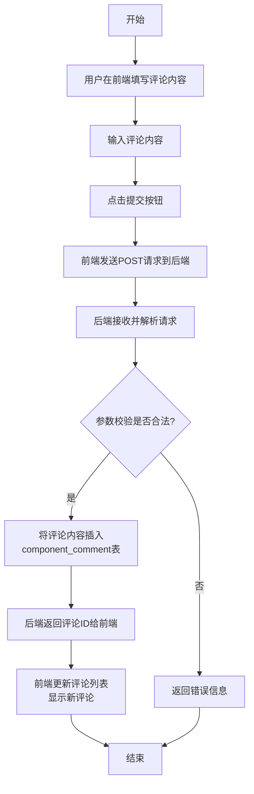
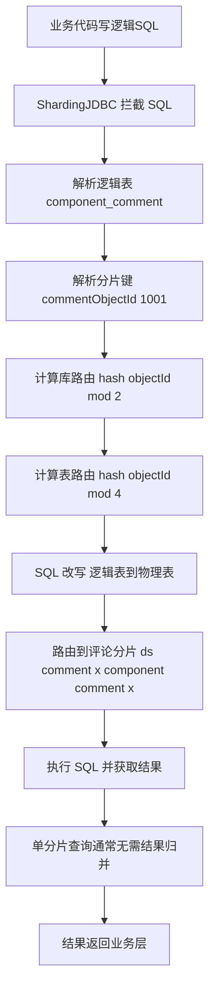
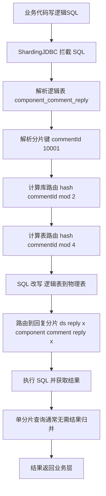

# 评论系统技术设计方案文档

# 一、需求分析  

## 1.1 需求背景  

**1. 需求分析**  

   - **背景**：参考小红书、哔哩哔哩等成熟平台的评论功能，采用Spring Boot、MySQL、Redis等技术栈，提供HTTP接口实现评论系统的基础功能。本期为第一课，重点完成基础评论功能。  

   - **存在的问题**：  
     - 设计一个完整的评论平台系统设计示例
     - 需要设计清晰的评论与回复关系模型，支持多种回复场景  
     - 需要设计合理的数据表结构以支撑评论业务的扩展  

   - **期望形态**：  
     - 实现一个基础的评论系统，支持用户对任意实体对象进行评论  
     - 支持评论的创建、删除、编辑、置顶等基础管理功能  
     - 支持回复功能，包括回复评论、回复人、回复回复三种场景  
     - 支持回复的创建、删除、编辑功能  
     - 提供清晰的HTTP接口，方便前端调用  
     - 设计合理的数据库表结构，为后续分库分表、性能优化等迭代奠定基础  
     - 技术方案文档结构清晰，便于教学使用  

## 1.2 业务名词  

| 业务名词 | 业务解释 |
|---------|----------|
| 评论对象 | 用户进行评论的目标实体，如题解、面经、跳蚤平台帖子等 |
| 评论类型 | 用于标识不同的评论对象类型，如1表示题解，2表示面经，3表示跳蚤平台 |
| 评论 | 用户对某个评论对象发表的原始观点或评价 |
| 回复 | 对已有评论或其他回复的二次互动 |
| 回复类型 | 标识回复的目标类型，包括回复评论、回复人、回复回复 |
| 逻辑删除 | 标记数据已删除但实际不删除数据库记录的方式 |
| 置顶 | 将重要评论固定在评论列表顶部的功能 |
| 热评 | 按点赞数 + 时间热度排序的高互动评论 |

## 1.3 课程规划  

| 课时 | 主要内容 | 涉及技术点 |  
|------|----------|------------|  
| 第一课 | 基础评论功能（评论CRUD、回复CRUD、列表加载） | Spring Boot、MySQL、HTTP接口设计 |  
| 第二课 | 评论/回复点赞功能、Redis性能优化 | Redis缓存设计、性能优化 |  
| 第三课 | 分库分表能力、高扩展性设计 | 分库分表策略、分布式架构设计 |  

## 1.4 引用文档（3.5新增）

- 需求文档（PRD）：《通用评论平台产品需求文档 V1.0》

- 技术规范：《Spring Boot 后端开发规范 V2.0》

- 数据库规范：《MySQL 数据库设计规范 V1.5》

# 二、系统与流程设计  

## 2.1 系统架构


**架构说明**：

- 前端层：支持多端调用，统一通过 API 网关访问后端服务

- 网关层：负责路由转发、鉴权、限流、日志记录

- 服务层：

  - 评论服务：核心业务服务，处理评论 / 回复的 CRUD、排序、统计等
  - 用户服务：提供用户信息、权限校验等能力
  - 内容审核服务：提供评论内容的敏感词审核、违规检测

  

- 数据层：

  - MySQL：存储核心业务数据（评论、回复、用户关系等）
  - Redis：缓存评论列表、点赞数、热评排序等热点数据
  - Elasticsearch：支持评论的全文搜索、高级筛选
  - Kafka：异步处理通知、统计更新、缓存清理等非核心逻辑

### 2.1.1 业务访问模式与分片键选择依据

- `核心访问模式一：对象详情页 -> 评论列表`
- `核心访问模式二：评论详情/展开 -> 回复列表`
- `非主路径查询：按用户反查评论历史`
- `结论：评论表按 comment_object_id 分片，回复表按 comment_id 分片`

#### 2.1.1.1 评论系统的核心访问模式

评论平台的主要访问模式并不是“用户全局浏览所有评论”，而是围绕内容详情页展开，典型链路如下：

1. 用户先进入某个**内容对象**的**详情页**，例如：
   - 某个视频
   - 某篇专栏文章/题解/面经
   - 某个商品页面；
2. 前端基于该内容对象加载评论列表；
3. 用户点击某条评论后，再展开该评论下的回复列表；
4. 若继续查看楼中楼，则基于某条回复继续向下展开。

因此，评论系统最核心的两类查询分别是：

\- **评论列表查询**：按 `comment_object_id + comment_type` 查询某个对象下的评论；

\- **回复列表查询**：按 `comment_id` 查询某条评论下的回复，再结合 `parent_reply_id` 区分第一层回复和楼中楼回复。

这意味着评论系统的访问模式天然具备明显的“对象维度聚合”特征和“评论维度聚合”特征，而不是用户维度聚合特征。

#### 2.1.1.2 **评论表分片键选择原因**

`component_comment` 表的核心业务含义是：**某个评论对象下的一级评论集合**。  
评论列表的高频查询 SQL 形态如下：

```sql
SELECT *
FROM component_comment
WHERE comment_object_id = ?
  AND comment_type = ?
  AND is_delete = 0
ORDER BY sort DESC, create_time DESC
LIMIT ?, ?;
```

由此可以看出，一级评论的主查询条件天然就是 `comment_object_id`（配合 `comment_type` 区分业务对象类型）。因此，评论表最合适的分片键是：

- 分片键：`comment_object_id`
- 辅助业务维度：`comment_type`

选择 `comment_object_id` 作为分片键的原因如下：

1. 符合主查询路径：用户进入详情页后，一定是先按对象维度查询评论列表；
2. 同一对象的评论可尽量落在同一分片：便于评论列表分页、排序、置顶、热评等操作在单分片内完成；
3. 降低跨分片聚合成本：避免查询某个对象评论时扫描多个分片；
4. 便于后续缓存设计协同：评论缓存、热评缓存、点赞缓存通常也按对象维度组织。

不选择 `comment_user_id` 作为评论表分片键的原因：**用户维度并不是评论系统的主查询入口**。如果按用户 ID 分片，那么**同一个视频/帖子下的评论会被打散到多个分片**，导致评论列表查询必须做**跨分片聚合**，违背评论系统最核心的访问模式。

#### 2.1.1.3 回复表分片键选择原因

component_comment_reply 表的核心业务含义是：**围绕某条一级评论展开的回复集合**。
回复列表的高频查询 SQL 形态如下：

```sql
SELECT *
FROM component_comment_reply
WHERE comment_id = ?
  AND parent_reply_id = 0
  AND is_delete = 0
ORDER BY create_time ASC
LIMIT ?, ?;
```


或：

```sql
SELECT *
FROM component_comment_reply
WHERE comment_id = ?
  AND parent_reply_id = ?
  AND is_delete = 0
ORDER BY create_time ASC
LIMIT ?, ?;
```


由此可以看出，回复查询的核心聚合维度是 **comment_id**，而不是 parent_reply_id。因为无论是一层回复还是楼中楼回复，它们最终**都归属于某条一级评论**。

因此，回复表最合适的分片键是：

- 分片键：comment_id

选择 comment_id 作为回复表分片键的原因如下：

1. 符合回复主查询路径：用户一定是先进入某条评论，再查看其下的回复；
2. 同一评论下的回复可尽量落在同一分片：便于分页加载、楼中楼展开、删除评论时处理回复链等操作；
3. 降低树形结构查询复杂度：回复树虽然通过 parent_reply_id 建立父子关系，但业务归属始终是某条一级评论；
4. 便于维护评论级统计字段：例如 reply_count 的维护天然围绕 comment_id 进行。

不选择 **parent_reply_id** 作为回复表分片键原因： parent_reply_id 仅表示“直接回复的是谁”，它**只能表达局部父子关系，不能表达整条回复链最终归属于哪条一级评论**。如果按 parent_reply_id 分片，会导致同一评论下的回复树被打散到不同分片，反而增加查询和维护复杂度。

## 2.2 服务总体设计

### 2.2.1 功能点梳理

| 功能模块 | 具体功能                             | 状态   |
| :------- | :----------------------------------- | :----- |
| 评论管理 | 评论创建、删除、编辑、置顶、点赞     | 已实现 |
| 回复管理 | 回复创建、删除、编辑、点赞           | 已实现 |
| 列表查询 | 评论列表查询、回复列表查询、热评排序 | 已实现 |
| 内容审核 | 敏感词检测、违规内容拦截             | 待补充 |
| 通知推送 | 评论 / 回复 @通知、点赞通知          | 待补充 |
| 数据统计 | 评论数统计、点赞数统计、互动数据报表 | 待补充 |

### 2.2.2 流程设计

#### 2.2.2.1 评论创建流程  

用户在前端填写评论内容，提交到后端创建评论接口。后端接收请求后，进行参数校验，然后持久化到`component_comment`表，返回评论ID给前端。前端展示评论列表时更新显示新评论。  



##### 2.2.2.1.1 时序图


前端发一个创建请求 → Controller 收到 → Service 做所有核心逻辑（校验、分流、落库）→ Mapper 操作数据库 → DB 返回 ID → Service 异步发 MQ → 成功后立刻返回前端，异步更新计数。

**详细步骤讲解：**

1. **前端发起请求** 用户点击“发布评论/回复”按钮，前端调用 POST /api/comment/create，带上参数： type=1（评论）或 type=2（回复）、content、commentObjectId、parentId 等。
2. **Controller 接收请求**CommentController 收到请求后，几乎不做业务处理，直接调用 CommentService.createCommentOrReply(request)。
3. **Service 开始核心处理**CommentService 按顺序做三件事：
   - 第一步：参数校验（必填字段、空值、长度）
   - 第二步：敏感词过滤
   - 第三步：权限校验（只能操作自己的评论/回复）
4. **校验失败分支（异常处理）** 如果任何一步失败，Service 直接抛出 BusinessException，Controller 捕获后返回： { "code": 1, "message": "参数非法 / 包含敏感词 / 无权限" } 前端直接提示错误。
5. **校验通过 → 分流处理** Service 根据 type 判断：
   - **type=1（创建一级评论）** 调用 CommentMapper.insert(commentDO) → Mapper 生成 SQL：INSERT INTO component_comment ... → 数据库返回自增主键 id
   - **type=2（创建回复）** 调用 ReplyMapper.insert(replyDO)（带 parent_reply_id 和 reply_type） → 数据库插入到 component_comment_reply 表 → 返回自增 id
6. ###  异步发送 MQ（优化点）

   Service  →  MQ  →  多个消费者

   创建回复成功后：

   ```
   mqSender.send(new ReplyCreatedEvent(commentId));
   ```

   ⚠ 不等待 MQ 执行
    ⚠ 不影响主线程

   主线程：

   - 插入数据 → 返回成功

   MQ 消费者负责：

   - reply_count +1
   - 发送通知
   - 更新热度
   - 写日志
7. **返回成功给前端** Service 把 id、type 等信息封装成 VO，返回给 Controller。 Controller 返回标准成功响应： { "code": 0, "message": "创建成功", "data": { "id": 10001, "type": 1, ... } }

##### 2.2.2.1.2同步与异步拆分设计

同步部分（必须成功才返回）：
1. 参数校验
2. 插入数据库
3. 事务提交

异步部分（MQ）：
1. 评论计数更新
2. 热度排序更新
3. 审核队列
4. 通知系统

#### 2.2.2.2 评论删除流程 （2026.3.5版本更新） 

用户删除评论时，前端调用删除接口。后端接收评论 ID 和操作人 ID，校验权限（仅评论作者 / 管理员可删除），仅对一级评论执行逻辑删除（`is_delete`字段标记为 1），**删除流程中不处理任何子回复**；子回复的展示 / 过滤通过 “查询时关联评论表判断状态” 实现，彻底规避同步级联删除的风险，返回操作结果。

##### 删除一级评论的同步与异步（重构版）

核心原则：**同步操作仅保留 “核心必要逻辑”，异步操作仅做轻量清理，完全不处理子回复**。

##### 同步操作（核心，小事务执行）

1. 权限校验：验证操作人是否为评论作者 / 系统管理员，非权限用户直接返回 “无删除权限”；
2. 数据校验：校验评论 ID 是否存在、是否已被逻辑删除，无效数据直接返回 “评论不存在或已删除”；
3. 逻辑删除评论：仅更新`component_comment`表中该评论的`is_delete=1`，并记录删除时间 / 操作人（单条 UPDATE，耗时 < 10ms）；
4. 结果返回：同步操作执行完成后，立即向前端返回 “删除成功”（无需等待异步操作）。

##### 异步操作（非核心，不阻塞用户请求）

1. 清理缓存：删除 Redis 中该评论所属对象的评论列表缓存、点赞数缓存（避免脏数据）；
2. 日志记录：记录评论删除日志（操作人、删除时间、评论 ID 等），用于溯源 / 审计；
3. （可选）发送通知：若有评论作者关注通知，异步发送 “评论已删除” 的站内通知。

> 关键调整：异步流程中**移除 “逻辑删除 reply 表”“扣减 reply_count”** 操作，彻底规避批量更新子回复带来的锁表 / 大事务风险；`reply_count`字段可在查询评论列表时，通过`COUNT(*)`从回复表实时统计（或缓存），无需删除评论时同步扣减。


##### 同步级联删除的问题分析

如果 comment 下有 5000 条回复

一个事务里全部 UPDATE

会：

- 锁时间长
- 事务过大
- 回滚成本高
- 高并发下容易死锁

 


> 注：原流程图需调整，移除 “级联删除回复”“扣减回复数” 分支，仅保留 “删评论→清理缓存→返回结果” 核心链路。


##### 优化后的子回复处理逻辑（无新增字段版）

子回复不做任何删除 / 更新操作，仅在**查询阶段**通过 “关联评论表” 判断所属一级评论是否已删，决定是否展示：

1. 子回复查询 SQL（核心）

```sql
-- 前端展示用：仅返回“所属评论未删+自身未删”的子回复
SELECT r.* 
FROM component_comment_reply r
LEFT JOIN component_comment c ON r.comment_id = c.id
WHERE r.comment_id = ?        -- 目标评论ID
  AND r.is_delete = 0         -- 子回复自身未被逻辑删除
  AND c.is_delete = 0;        -- 所属一级评论未被逻辑删除

-- 后台溯源用：返回所有子回复，标注所属评论状态（用于审计/申诉）
SELECT r.*, c.is_delete AS parent_comment_deleted
FROM component_comment_reply r
LEFT JOIN component_comment c ON r.comment_id = c.id
WHERE r.comment_id = ?;
```

2. Java 层过滤逻辑（无需修改 VO）

```java
// 原有ReplyVO（无任何新增/修改）
public class ReplyVO {
    private Long id;          // 回复ID
    private Long commentId;   // 所属评论ID
    private String content;   // 回复内容
    private Integer likeCount;// 点赞数
    // 其他原有字段（createTime、createBy等）
}

/**
 * 组装回复VO列表：过滤所属评论已删的子回复
 * @param commentId 目标评论ID
 * @return 前端可展示的回复列表
 */
public List<ReplyVO> buildReplyVOList(Long commentId) {
    // 1. 查询子回复（关联评论表获取所属评论删除状态）
    List<Reply> replyList = replyMapper.selectByCommentIdWithCommentStatus(commentId);
    
    // 2. 过滤：仅保留所属评论未删的子回复
    return replyList.stream()
        .filter(reply -> 0 == reply.getParentCommentDeleted()) // 该字段由SQL JOIN生成，非表字段
        .map(reply -> {
            ReplyVO vo = new ReplyVO();
            vo.setId(reply.getId());
            vo.setCommentId(reply.getCommentId());
            vo.setContent(reply.getContent());
            vo.setLikeCount(reply.getLikeCount());
            return vo;
        })
        .collect(Collectors.toList());
}
```

#### 2.2.2.3 评论编辑流程  

用户编辑评论时，前端调用编辑接口。后端接收评论ID、新内容和操作人ID，校验权限，更新`content`字段和`update_time`，返回操作结果。  


#### 2.2.2.4 评论置顶流程  

管理员或其他有权限的用户置顶评论时，前端调用置顶接口。后端接收评论ID，更新`sort`字段为较大值，返回操作结果。前端加载评论列表时按照`sort`降序、`create_time`降序排序。  


#### 2.2.2.5 回复创建流程  

用户创建回复时，前端调用创建回复接口。后端接收评论ID、回复类型、回复内容、回复人ID、被回复人ID（如果是回复人）等信息，持久化到`component_comment_reply`表，返回回复ID。  

**回复类型说明：**  
- 回复类型1：回复评论（直接回复某条评论）  
- 回复类型2：回复人（回复某条评论下的某个人）  
- 回复类型3：回复回复（回复某条回复）  


#### 2.2.2.6 回复删除流程  

用户删除回复时，前端调用删除回复接口。后端接收回复ID和操作人ID，校验权限，将`is_delete`字段标记为1，返回操作结果。  


#### 2.2.2.7 回复编辑流程  

用户编辑回复时，前端调用编辑回复接口。后端接收回复ID、新内容和操作人ID，校验权限，更新`content`字段和`update_time`，返回操作结果。  


#### 2.2.2.8 评论列表加载流程  

前端加载某个对象的评论列表时，后端根据`comment_object_id`和`comment_type`查询`component_comment`表，过滤`is_delete=0`的记录，按照`sort`降序、`create_time`降序排序，支持分页返回。评论下可以包含该评论的前N条回复。  


##### 2.2.2.8.1 时序图

.svg)

.png)

##### 2.2.2.8.2 评论列表加载方案（2026.3.5更新）

前端请求某个对象的评论列表 → Controller 转发 → Service 组装查询条件 → Mapper 分两次查询数据库（先查评论，再查每条评论的前N条回复）→ 组装后返回。

**详细步骤讲解：**

1. **前端发起请求** 前端调用 GET /api/comment/list?commentObjectId=1001&commentType=1&page=1&pageSize=20&topReplyLimit=3

2. **Controller 接收请求**CommentController 简单接收参数后，调用 CommentService.listComments(request)。

3. **Service 做准备工作**

   - 参数校验（ID是否为空、分页参数是否合法）
   - 构建查询条件（必须加上 is_delete=0）

4. **校验失败分支（异常处理）** 如果参数非法，Service 抛异常，Controller 返回： { "code": 1, "message": "参数错误" }

5. **校验通过 → 查询主表** 

   ##### 5A. **查询总条数（分页必须）**

   Service 先调用：

   ```java
CommentMapper.countByCondition(...)
   ```
   
   Mapper 生成 SQL：

   ```sql
SELECT COUNT(*) 
   FROM component_comment
   WHERE comment_object_id = ?
     AND comment_type = ?
     AND is_delete = 0;
   ```
   
   → 数据库返回 total

   > 说明：分页查询必须先统计总条数，否则前端无法展示总页数。

   ------

   **5B**. **查询当前页评论列表**

   Service 调用：

   ```
CommentMapper.selectPage(...)
   ```
   
   Mapper 生成 SQL：

   ```
SELECT * FROM component_comment 
   WHERE comment_object_id = ? 
     AND comment_type = ? 
     AND is_delete = 0
   ORDER BY sort DESC, create_time DESC
   LIMIT ?, ?;
   ```
   
   → 数据库返回当前页评论列表
 （每条评论包含 reply_count 字段，**不需要再 count 子回复**）
   
   ```SQL
SELECT * FROM component_comment 
   WHERE comment_object_id = ? AND comment_type = ? AND is_delete = 0
   ORDER BY sort DESC, create_time DESC 
   LIMIT ?, ?
   ```
   
   → 数据库返回当前页的评论列表（每条评论包含 reply_count）

6. **~~循环~~批量查询每条评论的前N条回复（2026.3.5重点优化）**

   > 前置说明：
   >  在第 5 步中，我们已经完成了评论主表查询，拿到了当前页的评论列表（例如 20 条评论）。

   此时需求是：

   > **为每条评论加载前 N 条一级回复（默认 3 条）** 

   优化方案：批量查询 + **让 Java 的应用层分组封装**

   #####  6A. **收集评论 ID**
   
    Service 层收集当前页所有评论的 ID：
   
   ```java
   List<Long> commentIds = commentList.stream()
        .map(Comment::getId)
           .collect(Collectors.toList());
```
   
#####  6B. **批量查询所有回复**
   
 Service 调用：
   
```Plain
   ReplyMapper.selectByCommentIds(commentIds)
```

 Mapper 生成 SQL：

```sql
   SELECT * FROM component_comment_reply
   WHERE comment_id IN (?, ?, ..., ?)  -- 20个评论ID
     AND parent_reply_id = 0           -- 只查一级回复
     AND is_delete = 0                 -- 排除已删除的回复
   ORDER BY create_time ASC;           -- 按时间正序
```

 → 数据库返回所有符合条件的回复列表

> 评论表加字段：前三条回复id

#####  2.2.2.8.3 **应用层分组组装**

    Service 层在内存中按评论 ID 分组，并为每条评论截取前 N 条回复：

   ```java
   // 按评论ID分组
   Map<Long, List<Reply>> replyMap = replyList.stream()
           .collect(Collectors.groupingBy(Reply::getCommentId));
   // 作用：把混合的回复列表，按「回复所属的评论 ID」分成不同的组。
   // 举个例子：
   // 分组后会形成一个 “评论 ID→该评论所有回复” 的映射，比如：
// key = 评论 1 的 ID → value = 评论 1 的所有一级回复（3 条）
   // key = 评论 2 的 ID → value = 评论 2 的所有一级回复（2 条）
// key = 评论 3 的 ID → value = 评论 3 的所有一级回复（5 条）
   // 没有回复的评论，不会出现在这个 map 里（后续用getOrDefault处理）。

   // 为每条评论设置前N条回复
   int topN = request.getTopReplyLimit() != null ? request.getTopReplyLimit() : 3;
   
   for (Comment comment : commentList) {
     // 1. 拿到当前评论的所有回复（没有就返回空列表，避免空指针）
    List<Reply> replies = replyMap.getOrDefault(comment.getId(), new ArrayList<>());
       
       
      // 2. 按时间正序排序（再次确保顺序），截取前N条（topReplyLimit，默认3条<Reply> topReplies = replies.stream()
       List<Reply> topReplies = replies.stream()
               .sorted(Comparator.comparing(Reply::getCreateTime))
               .limit(topN)
               .collect(Collectors.toList());
   
     // 3. 把截取好的回复，设置到当前评论里
       comment.setTopReplies(topReplies);
   }
   ```

    **优化效果说明：**
    
    (1) **消除 N+1 查询**

   - 无论一页有多少条评论，都只执行 **2 次 SQL**（评论 + 回复）。
   - 数据库连接次数从 21 次降为 2 次，大幅降低连接开销和网络往返。

    (2) **解决数据分布不均问题**

   - 通过应用层分组和截取，确保每条评论都能获取到前 N 条回复
- 避免了原方案中某些评论占据大部分回复名额的问题
  

 (3) **符合业务语义**

   - 回复列表按时间正序展示，满足 "每条评论下展示最早的前 N 条一级回复" 的需求
- 与小红书、B 站等主流平台的展示逻辑一致
  

 (4) **为缓存扩展打下基础**

- 后续引入 Redis 缓存时，该方案依然适用
   - 可以先从缓存拿评论，再从缓存拿回复，然后同样在应用层组装

   

7. **Service 组装最终结果** 把总条数、分页信息、评论列表（含 topReplies）封装成 PageResult 对象。

8. **Controller 返回给前端** 返回完整 JSON： { "code": 0, "data": { "total": 100, "list": [ {id:..., topReplies:[...]} , ... ] } }

#### 2.2.2.9 回复列表加载流程  

前端加载某条评论下的回复列表时，后端根据`comment_id`查询`component_comment_reply`表，过滤`is_delete=0`的记录，按照`create_time`升序排序，支持分页返回。 

 

#### 2.2.2.10 评论点赞流程


#### 2.2.2.11 内容审核流程


#### 2.2.2.12 热评列表加载流程

前端加载某个对象的热评列表时，后端根据 `commentObjectId` 和 `commentType` 查询热评数据。系统优先从 Redis 热评缓存中读取，若缓存命中则直接返回；若缓存未命中，则查询 MySQL 中的评论数据，按热度规则排序后写入 Redis，再返回结果。热评列表仅返回一级评论，不直接返回全部回复；若前端需要展示回复预览，可复用评论列表接口中的 `topReplies` 组装逻辑。

**热度排序规则说明：**

- 置顶评论优先：按 `sort` 降序
- 非置顶评论按热度分降序
- 热度分可采用如下公式：

```
hotScore = likeCount * 100 + 时间因子
```

其中：

- `likeCount`：评论点赞数
- 时间因子：用于让新评论在点赞数接近时具备一定竞争力，避免老评论长期垄断热榜

在缓存层中，热评可通过 Redis ZSet 维护：

```
Key: comment:hot:obj:{commentObjectId}:type:{commentType}
member: commentId
score: hotScore
```

------

##### 2.2.2.12.1 Mermaid 流程图

.png)

------

##### 2.2.2.12.2 详细步骤讲解

1. **前端发起请求**
    前端调用：

   ```
   GET /api/comment/hot?commentObjectId=1001&commentType=1&page=1&pageSize=10
   ```

2. **Controller 接收请求**
    `CommentController` 接收到请求后，调用：

   ```
   CommentService.listHotComments(request)
   ```

3. **Service 做准备工作**

   - 校验 `commentObjectId` 是否为空
   - 校验 `commentType` 是否合法
   - 校验分页参数 `page/pageSize` 是否合法
   - 拼接热评缓存 Key：

   ```
   comment:hot:obj:{commentObjectId}:type:{commentType}
   ```

4. **校验失败分支（异常处理）**
    如果参数非法，Service 抛出异常，Controller 返回：

   ```
   {
     "code": 1,
     "message": "参数错误"
   }
   ```

5. **优先查询 Redis 热评缓存**

   Service 先查询 Redis 的 ZSet：

   ```
   ZREVRANGE comment:hot:obj:1001:type:1 start end
   ```

   其中：

   - `member` = `commentId`
   - `score` = 热度分

6. **缓存命中处理**

   如果 Redis 命中当前页评论 ID 列表，则：

   - 批量查询这些评论详情
   - 按 Redis 返回顺序组装结果
   - 如有需要，可附带预加载每条评论的前 N 条一级回复
   - 直接返回前端

7. **缓存未命中处理**

   若 Redis 未命中，则查询 MySQL：

   ```
   SELECT *
   FROM component_comment
   WHERE comment_object_id = ?
     AND comment_type = ?
     AND is_delete = 0
   ORDER BY sort DESC, like_count DESC, create_time DESC
   LIMIT ?, ?;
   ```

   > 第一版可以先用 `like_count DESC, create_time DESC` 近似表示热度；
   >  第二课引入 Redis 热榜后，再统一由 ZSet score 计算热度分。

8. **写入缓存**

   查询出评论列表后，Service 将评论 ID 和热度分写入 Redis ZSet：

   ```
   ZADD comment:hot:obj:1001:type:1 score1 commentId1 score2 commentId2 ...
   ```

   并设置过期时间，例如 1 小时。

9. **组装返回结果**

   Service 将评论数据封装为分页对象并返回：

   ```
   {
     "code": 0,
     "message": "查询成功",
     "data": {
       "total": 20,
       "page": 1,
       "pageSize": 10,
       "list": [...]
     }
   }
   ```


> 说明：
>  第一版热评列表可先基于数据库字段 `like_count` + `create_time` 排序实现，满足基础功能；
>  后续在 Redis 引入 ZSet 热榜缓存后，再将热度计算迁移到缓存层，提升查询性能，降低数据库排序压力。

#### 2.2.2.13 用户历史评论列表加载流程

“我评论过哪些”是评论系统中一个典型的**用户维度反查场景**。与“某个对象下的评论列表”“某条评论下的回复列表”不同，这类查询不是沿着评论系统主路径（对象维度 / 评论维度）进行，而是沿着用户维度进行聚合，因此在分库分表场景下会天然更复杂。
###### 业务场景说明
典型使用场景如下：
1. 用户进入个人中心页面；
2. 点击“我的评论”或“我的互动”；
3. 前端希望展示“我评论过哪些内容对象”，例如我评论过哪些题解、面经、帖子、视频；
4. 每条结果通常需要展示：
   - 内容对象 ID
   - 内容对象类型
   - 我最近一次评论 / 回复的内容摘要
   - 最近评论时间
   - 我在该对象下评论或回复的次数（可选）
   这类查询的核心特点是：
- 查询条件是 `userId`
- 返回结果按“内容对象维度”聚合
- 但评论系统的主分片键并不是 `userId`
###### 分库分表场景下的难点
本项目分库分表设计中：
- 评论表 `component_comment` 按 `comment_object_id` 分片；
- 回复表 `component_comment_reply` 按 `comment_id` 分片。
因此，“我评论过哪些”这个场景会遇到以下问题：
1. **查询条件不命中评论表分片键**
   - 评论表主分片键是 `comment_object_id`
   - 但该场景的查询条件是 `comment_user_id`
   - 若直接按用户查询评论表，会触发跨分片扫描
2. **查询条件不命中回复表分片键**
   - 回复表主分片键是 `comment_id`
   - 但该场景的查询条件是 `reply_user_id`
   - 若直接按用户查询回复表，同样会触发跨分片扫描
3. **需要将评论与回复统一聚合到“内容对象维度”**
   - 评论记录直接持有 `comment_object_id + comment_type`
   - 回复记录本身不直接持有对象维度信息，需要先通过 `comment_id` 找到所属一级评论，再拿到对象信息
   - 这意味着用户维度反查不仅跨分片，还可能需要额外关联
   因此，在分库分表场景下，**不适合直接扫评论表和回复表来实现“我评论过哪些”功能**。
###### 优化思路：增加用户评论索引表
为了解决用户维度反查问题，本项目设计引入一张**用户评论行为索引表**，专门支撑“我评论过哪些”这类用户维度查询。
示例逻辑表：

```text
component_user_comment_index
```

表中可存储如下关键字段：

- `user_id`：用户 ID
- `comment_object_id`：评论对象 ID
- `comment_type`：评论对象类型
- `interaction_type`：互动类型（1=评论，2=回复）
- `target_comment_id`：触发行为对应的评论 ID
- `target_reply_id`：触发行为对应的回复 ID（若是回复）
- `latest_content`：最近一次评论 / 回复内容摘要
- `latest_time`：最近互动时间
- `interaction_count`：该用户在该对象下的累计互动次数

该索引表的核心作用是：

- 按 `user_id` 维度组织数据；
- 将原本分散在评论表、回复表中的用户互动行为，提前归并成用户可查询的结构；
- 避免每次打开“我的评论”页面都跨分片扫描业务主表。

###### 数据写入流程

当用户执行以下操作时：

- 创建一级评论
- 创建回复

在主流程完成写库后，可异步发送消息，由消费者维护 `component_user_comment_index` 表。

示意流程如下：

1. 用户发表评论或回复成功；
2. 主流程写入评论表 / 回复表；
3. 发送评论行为事件到 MQ；
4. 用户评论索引消费者消费该消息；
5. 根据用户行为更新 `component_user_comment_index`：
   - 若该用户首次在某对象下互动，则插入一条索引记录；
   - 若该用户已在该对象下互动过，则更新：
     - `latest_content`
     - `latest_time`
     - `interaction_count + 1`

这样就把原本“按用户跨分片扫主表”的高成本查询，转化为“查一张用户维度索引表”的低成本查询。

###### 查询流程设计

用户历史评论列表加载功能的查询流程如下：

1. 前端发起“我的评论”列表请求；
2. Controller 接收请求并调用 Service；
3. Service 按 `userId` 查询 `component_user_comment_index`；
4. 根据 `latest_time` 倒序分页返回；
5. 返回内容对象维度的列表结果给前端。

查询 SQL 示例：

```sql
SELECT *
FROM component_user_comment_index
WHERE user_id = ?
ORDER BY latest_time DESC
LIMIT ?, ?;
```

若需要进一步展示对象标题、封面等内容摘要信息，可再根据 `comment_object_id + comment_type` 调用内容服务或对象详情服务进行补充组装。

###### 方案收益

该设计的优势如下：

1. 避免跨分片扫主表
   - 用户维度查询不再直接扫描评论表和回复表
2. 查询链路更稳定
   - “我的评论”页面只需命中用户索引表
3. 符合分库分表后的读写分离思路
   - 主表继续服务对象维度 / 评论维度主路径查询
   - 用户索引表专门服务用户维度反查
4. 便于后续扩展
   - 后续可以继续扩展“我点赞过哪些”“我回复过哪些”“我收到哪些回复”等用户维度功能

###### 方案代价

该设计也存在一定代价：

- 需要新增一张索引表；
- 主流程之外需要额外维护索引一致性；
- 删除评论 / 删除回复时，需要同步或异步更新用户索引；
- 允许短时间最终一致，不保证强一致实时可见。

因此，本项目对“我评论过哪些”场景的设计原则是：

> 在分库分表场景下，主业务表优先服务对象维度和评论维度查询；用户维度反查通过额外索引表承接，以换取更稳定的查询性能。


### 2.2.3 时序设计

.png)

### 2.2.4 类图设计


### 2.2.5 枚举设计

```java
// 评论类型枚举
public enum CommentTypeEnum {
    QUESTION_SOLUTION(1, "题解"),
    INTERVIEW_EXPERIENCE(2, "面经"),
    FLEA_MARKET(3, "跳蚤平台");
    
    private final Integer code;
    private final String desc;
    
    CommentTypeEnum(Integer code, String desc) {
        this.code = code;
        this.desc = desc;
    }
    
    public static CommentTypeEnum getByCode(Integer code) {
        for (CommentTypeEnum type : values()) {
            if (type.code.equals(code)) {
                return type;
            }
        }
        return null;
    }
}

// 回复类型枚举
public enum ReplyTypeEnum {
    REPLY_COMMENT(1, "回复评论"),
    REPLY_REPLY(2, "回复回复");
    
    private final Integer code;
    private final String desc;
    
    ReplyTypeEnum(Integer code, String desc) {
        this.code = code;
        this.desc = desc;
    }
    
    public static ReplyTypeEnum getByCode(Integer code) {
        for (ReplyTypeEnum type : values()) {
            if (type.code.equals(code)) {
                return type;
            }
        }
        return null;
    }
}

// 审核状态枚举
public enum AuditStatusEnum {
    PENDING(0, "待审核"),
    PASS(1, "审核通过"),
    REJECT(2, "审核不通过");
    
    private final Integer code;
    private final String desc;
    
    AuditStatusEnum(Integer code, String desc) {
        this.code = code;
        this.desc = desc;
    }
    
    public static AuditStatusEnum getByCode(Integer code) {
        for (AuditStatusEnum status : values()) {
            if (status.code.equals(code)) {
                return status;
            }
        }
        return null;
    }
}
```


## 2.3 接口设计  

### 2.3.1 HTTP接口设计  (3.5修改)

> 前端原调用两个接口，现在传多一个 type/parentId 参数(reply 表的 parent_reply_id 字段)即可 

> 3.5加入点赞、审核、获取热评论

| 序号 | 接口名称 | 接口路径 | 请求方式 | 功能描述 | 主要变更 & 理由 |
|------|----------|----------|----------|----------|----------|
| 1 | 创建评论/回复 | /api/comment/create | POST | 创建一条新的评论或回复 | 合并原1+6；参数加 type (1一级,2回复) + parentId/beRepliedUserId；创建流程图显示校验/敏感词/父评论存在校验几乎相同 |
| 2 | 删除评论/回复 | /api/comment/delete | POST | 统一删除一条评论/回复 | 合并原2+7；参数 commentId 或 replyId；删除流程图显示可统一判断类型后级联 + 事务 + 计数减 |
| 3 | 编辑评论/回复 | /api/comment/edit | POST | 统一编辑一条评论或回复的内容 | 合并原3+8；参数 id + 新content/images；编辑流程类似（权限 + 敏感词） |
| 4 | 置顶评论 | /api/comment/pin | POST | 置顶/取消置顶一条评论 |  |
| 5 | 评论列表 | /api/comment/list | GET | 获取某个对象的评论列表 |  |
| 6 | 回复列表 | /api/reply/list | GET | 获取某条评论下的回复列表 |  |
| 7 | 点赞评论 / 回复 | /api/comment/like | POST | 对评论或回复进行点赞 / 取消点赞 | |
| 8 | 取消点赞 | /api/comment/unlike | POST | 取消对评论或回复的点赞 | |
| 9 | 评论审核回调 | /api/comment/audit/callback | POST | 内容审核服务回调接口，返回审核结果 | |
| 10 | 获取热评列表 | /api/comment/hot | GET | 获取某个对象的热评列表 | |

#### 2.3.1.1 创建评论/回复  

**接口路径**：`POST /api/comment/create`  

**功能描述**：创建一条新的评论  

**请求参数**：

（新增）

**请求参数统一说明**：

- `type`（必填，Integer）：接口路由分流字段  
  - 1 → 创建/操作一级评论（存入 component_comment）  
  - 2 → 创建/操作回复（存入 component_comment_reply）  

- `parentId`（仅 type=2 时有效）：  
  - 0 → 第一层回复（parent_reply_id = 0, reply_type = 1）  
  - >0 → 楼中楼回复（parent_reply_id = parentId, reply_type = 2）

- **`topReplyLimit`（仅列表接口）：每条评论预加载的一级回复数量，默认 3**

- `userId`：**不要前端传递**，从登录态（JWT/Session）获取。


新增type 接口层的“路由分流字段”（discriminator）  

- 一级评论 → 存入 `component_comment`
- 回复 → 存入 `component_comment_reply`

```
type = 1  →  插 component_comment
type = 2  →  插 component_comment_reply
```

`userId` 不建议前端传，来自登录态（JWT/Session）。


A) 创建评论（type=1）

```json  
{
  "type": 1,
  "commentObjectId": 1001,  
  "commentType": 1,  
  "content": "这道题解得很详细，谢谢分享！",  
  "images": "[\"https://example.com/image1.jpg\"]",  
  // "userId": 12345  
}  
```

B1) 回复评论（type=2，第一层回复）

`parentId = 0`：表示这条回复**直接挂在一级评论下面**（第一层回复）

- 落库：`parent_reply_id = 0`，并且 `reply_type = 1`

`parentId > 0`：表示这条回复是**回复某条回复**

- 其中 `parentId` = 被回复的那条回复的 `component_comment_reply.id`
- 落库：`parent_reply_id = parentId`，并且 `reply_type = 2`

```json
{
  "type": 2,
  "commentId": 10001,
  "parentId": 0,
  "beRepliedUserId": -1,
  "content": "感谢分享，受益匪浅！",
  "images": []
}

```

B2) 回复回复（type=2，楼中楼）

```json
{
  "type": 2,
  "commentId": 10001,
  "parentId": 20001,
  "beRepliedUserId": 12346,
  "content": "我同意你说的，但补充一点…",
  "images": []
}
```

**返回结果**：  

```json  
{  
  "code": 0,  
  "message": "创建成功",  
  "data": {  
    "id": 10001,  
    "commentObjectId": 1001,  
    "commentType": 1,  
    "content": "这道题解得很详细，谢谢分享！",  
    "images": "[\"https://example.com/image1.jpg\"]",  
    "userId": 12345,  
    "createTime": "2026-02-05 10:30:00",  
    "updateTime": "2026-02-05 10:30:00"  
  }  
}  
```

返回结果（统一版）

```json
{
  "code": 0,
  "message": "创建成功",
  "data": {
    "type": 2,
    "id": 20002,
    "commentId": 10001,
    "parentId": 20001,
    "replyType": 2,
    "content": "我同意你说的，但补充一点…",
    "images": [],
    "replyUserId": 12348,
    "beRepliedUserId": 12346,
    "createTime": "2026-02-05 10:40:00",
    "updateTime": "2026-02-05 10:40:00"
  }
}
```

> 如果 type=1（评论），data 里返回 commentObjectId/commentType/sort/replyCount 等评论字段即可。


> **通知规则（可选扩展）**
>
> - 当创建回复成功后，后端根据 `commentId` 查询 `component_comment` 获取 `comment_user_id/comment_object_id/comment_type`。
> - 若 `parentId=0`（回复评论）：通知一级评论作者 `comment_user_id`。
> - 若 `parentId>0`（回复回复）：通知父回复作者（可通过 `parent_reply_id` 查 `component_comment_reply.reply_user_id`）。
> - `beRepliedUserId` 仅用于表示“UI 上定向回复谁（@关系）”，不等价于“是否通知”。


#### 2.3.1.2 删除评论  

**接口路径**：`POST /api/comment/delete`  

**功能描述**：删除一条评论（逻辑删除）  

**请求参数**：  

**把请求从 `{commentId}` 改成统一 `{type,id}`**，避免“commentId 或 replyId”二选一的歧义。

type=1：删 comment + 删该 comment 下全部 reply（comment_id 批量）+ reply_count 归零/扣减

type=2：删 reply + 删其子回复（parent_reply_id 递归/批量）+ reply_count 按实际删减

- 删除评论：

```json  
{  
  //"commentId": 10001,  
  "type": 1, 
  "id": 10001
  "userId": 12345  
}  
```

- 删除回复：

  ```json
  {  
    //"commentId": 10001,  
    "type": 2, 
    "id": 20001
    "userId": 12345  
  } 
  ```

  

**返回结果**：  

```json  
{  
  "code": 0,  
  "message": "删除成功",  
  "data": null  
}  
```

#### 2.3.1.3 编辑评论  

**接口路径**：`POST /api/comment/edit`  

**功能描述**：编辑一条评论的内容  

**请求参数**：  

- 编辑评论

```json  
{  
  "type": 1, 
  "id": 10001, 
  "content": "这道题解得非常详细，感谢分享！",  
  "images": "[]",  
  "userId": 12345  
}  
```

- 编辑回复

```json
{  
  "type": 2, 
  "id": 20001, 
  "content": "这道题解得非常详细，感谢分享！",  
  "images": "[]",  
  "userId": 12345  
}  
```


**返回结果**：

返回也带 `type`。

```json  
{  
  "code": 0,  
  "message": "编辑成功",  
  "data": { 
    "type": 1, 
    "id": 10001,  
    "content": "这道题解得非常详细，感谢分享！",  
    "images": "[]",  
    "updateTime": "2026-02-05 10:35:00"  
  }  
}  
```

#### 2.3.1.4 置顶评论  

**接口路径**：`POST /api/comment/pin`  

**功能描述**：置顶/取消置顶一条评论  

**请求参数**：  

- `operatorId` “从登录态获取”（不要前端传）/ 保留但注明“仅内部/管理端调用”。

```json  
{  
  "commentId": 10001,  
  "isPin": true,  
  "operatorId": 99999  
}  
```

**返回结果**：  

```json  
{  
  "code": 0,  
  "message": "置顶成功",  
  "data": null  
}  
```

#### 2.3.1.5 评论列表  

**接口路径**：`GET /api/comment/list`  

**功能描述**：获取某个对象的评论列表  

**请求参数**：  

- `commentObjectId` (Long, 必填)：评论对象ID  
- `commentType` (Integer, 必填)：评论类型  
- `page` (Integer, 可选，默认1)：页码  
- `pageSize` (Integer, 可选，默认20)：每页大小 
- `topReplyLimit` (Integer, 可选，默认3)：每条评论返回的一级回复数量（新增） 

**示例**：  

```  
GET /api/comment/list?commentObjectId=1001&commentType=1&page=1&pageSize=20&topReplyLimit=3  
```

**返回结果**：  

```json  
{  
  "code": 0,  
  "message": "查询成功",  
  "data": {  
    "total": 100,  
    "page": 1,  
    "pageSize": 20,  
    "list": [  
      {  
        "id": 10005,  
        "commentObjectId": 1001,  
        "commentType": 1,  
        "content": "置顶评论内容",  
        "images": "[]",  
        "userId": 12345,  
        "sort": 999,  
        "createTime": "2026-02-05 10:00:00",  
        "updateTime": "2026-02-05 10:00:00",  
        "replyCount": 5,  
        "topReplies": [  
          {  
            "id": 20001,  
            "commentId": 10005,  
            "replyType": 1,  
            "content": "回复内容",  
            "images": "[]",  
            "replyUserId": 12346,  
            "beRepliedUserId": -1,  
            "createTime": "2026-02-05 10:05:00",
            "updateTime": "2026-02-05 10:05:00" // 新增
          }  
        ]  
      },  
      {  
        "id": 10001,  
        "commentObjectId": 1001,  
        "commentType": 1,  
        "content": "普通评论内容",  
        "images": "[]",  
        "userId": 12345,  
        "sort": 0,  
        "createTime": "2026-02-05 09:00:00",  
        "updateTime": "2026-02-05 09:00:00",  
        "replyCount": 10,  
        "topReplies": [  
          {  
            "id": 20002,  
            "commentId": 10001,  
            "replyType": 2,  
            "content": "回复人内容",  
            "images": "[]",  
            "replyUserId": 12346,  
            "beRepliedUserId": 12345,  
            "createTime": "2026-02-05 09:10:00"  
          }  
        ]  
      }  
    ]  
  }  
}  
```

###### 1️⃣ 排序规则

评论排序：

```
ORDER BY sort DESC, create_time DESC
```

一级回复排序：

```
WHERE comment_id = ? AND parent_reply_id = 0
ORDER BY create_time ASC
LIMIT topReplyLimit
```

------

###### 2️⃣ replyType 说明（新版两态）

- `replyType = 1` → 回复评论（parentId = 0）
- `replyType = 2` → 回复回复（parentId > 0）

------

###### 3️⃣ parentId 语义

- `parentId = 0` → 一级回复
- `parentId > 0` → 楼中楼子回复（真实树形）

------

###### 4️⃣ replyCount 含义

`replyCount` 表示当前评论下 **所有回复总数（包含楼中楼）**，
 来源于 `component_comment.reply_count` 字段。


#### 2.3.1.6 回复列表  

**接口路径**：`GET /api/reply/list`  

**功能描述**：获取某条评论下的回复列表  *（支持按父回复ID加载：第一层/子回复）*

**请求参数**：  

- `commentId` (Long, 必填)：评论ID  
- `page` (Integer, 可选，默认1)：页码  
- `pageSize` (Integer, 可选，默认20)：每页大小
- ``parentId `` (表 2 parent_reply_id)
  - parentId=0：查第一层回复（parent_reply_id=0）
  - parentId=某 replyId：查某条回复的子回复（parent_reply_id=该值）

**示例**：  

```  
// GET /api/reply/list?commentId=10001&page=1&pageSize=20  
GET /api/reply/list?commentId=10001&parentId=0&page=1&pageSize=20
GET /api/reply/list?commentId=10001&parentId=20001&page=1&pageSize=20
```

**返回结果**：  

```json  
{  
  "code": 0,  
  "message": "查询成功",  
  "data": {  
    "total": 50,  
    "page": 1,  
    "pageSize": 20,  
    "list": [  
      {  
        "id": 20001,  
        "commentId": 10001,  
        "replyType": 1,  
        "content": "回复评论内容",  
        "images": "[]",  
        "replyUserId": 12346,  
        "beRepliedUserId": -1,  
        "createTime": "2026-02-05 09:10:00",  
        "updateTime": "2026-02-05 09:10:00"  
      },  
      {  
        "id": 20002,  
        "commentId": 10001,  
        "replyType": 2,  
        "content": "回复人内容",  
        "images": "[]",  
        "replyUserId": 12347,  
        "beRepliedUserId": 12346,  
        "createTime": "2026-02-05 09:15:00",  
        "updateTime": "2026-02-05 09:15:00"  
      },  
    ]  
  }  
}  
```


`2.2.2.10` 对应 `2.3.1.7` 和 `2.3.1.8`

`2.2.2.11` 对应 `2.3.1.9`

**新增一个 `2.2.2.12 热评列表加载流程`**，对应 `2.3.1.10`

#### 2.3.1.7 点赞评论 / 回复

**接口路径**：`POST /api/comment/like`

**功能描述**：对评论或回复进行点赞。后端根据 `targetType` 判断点赞目标是评论还是回复，校验用户是否已点赞，若未点赞则写入点赞记录，并更新目标对象的点赞数。

**请求参数**：

- `targetId`（Long，必填）：点赞目标 ID
- `targetType`（Integer，必填）：点赞目标类型
  - `1` → 点赞评论
  - `2` → 点赞回复
- `userId`：**不要前端传递**，从登录态（JWT/Session）获取

**请求示例**：

A) 点赞评论

```
{
  "targetId": 10001,
  "targetType": 1
}
```

B) 点赞回复

```
{
  "targetId": 20001,
  "targetType": 2
}
```

**返回结果**：

```
{
  "code": 0,
  "message": "点赞成功",
  "data": {
    "targetId": 10001,
    "targetType": 1,
    "liked": true
  }
}
```

**处理说明**：

1. 前端点击点赞按钮，请求 `/api/comment/like`
2. Controller 接收参数后，调用 `CommentService.like(request)`
3. Service 执行核心逻辑：
   - 参数校验（`targetId`、`targetType` 是否合法）
   - 校验目标对象是否存在、是否已删除
   - 校验当前用户是否已点赞（查询 `component_comment_like` 唯一索引）
4. 若未点赞：
   - 插入 `component_comment_like`
   - 更新评论表或回复表的 `like_count`
   - 可异步发送 MQ，更新热评分值 / 统计数据 / 通知
5. 返回点赞成功结果

**异常场景**：

- 目标对象不存在：返回“评论/回复不存在”
- 已重复点赞：返回“请勿重复点赞”

> 说明：
>  点赞接口只处理“从未点赞 → 已点赞”的状态变更；
>  是否已点赞建议前端通过列表接口中的 `liked` 字段或单独状态查询判断。

------

#### 2.3.1.8 取消点赞

**接口路径**：`POST /api/comment/unlike`

**功能描述**：取消对评论或回复的点赞。后端根据 `targetType` 判断目标类型，校验用户是否已点赞，若已点赞则删除点赞记录，并更新目标对象的点赞数。

**请求参数**：

- `targetId`（Long，必填）：取消点赞目标 ID
- `targetType`（Integer，必填）：点赞目标类型
  - `1` → 评论
  - `2` → 回复
- `userId`：**不要前端传递**，从登录态（JWT/Session）获取

**请求示例**：

A) 取消点赞评论

```
{
  "targetId": 10001,
  "targetType": 1
}
```

B) 取消点赞回复

```
{
  "targetId": 20001,
  "targetType": 2
}
```

**返回结果**：

```
{
  "code": 0,
  "message": "取消点赞成功",
  "data": {
    "targetId": 10001,
    "targetType": 1,
    "liked": false
  }
}
```

**处理说明**：

1. 前端点击取消点赞按钮，请求 `/api/comment/unlike`
2. Controller 调用 `CommentService.unlike(request)`
3. Service 执行核心逻辑：
   - 参数校验
   - 校验目标对象是否存在
   - 校验当前用户是否已点赞
4. 若已点赞：
   - 删除 `component_comment_like` 中对应记录
   - 更新评论表或回复表 `like_count = like_count - 1`
   - 异步更新热评分值、统计数据
5. 返回取消点赞成功结果

**异常场景**：

- 目标对象不存在：返回“评论/回复不存在”
- 当前未点赞：返回“当前未点赞，无需取消”

> 说明：
>  点赞与取消点赞拆成两个接口，语义清晰，便于前端分别绑定“点赞”和“取消点赞”操作。
>  若后续希望简化前端调用，也可以重构为单一“切换点赞状态”接口，但当前设计更利于教学和接口语义表达。

------

#### 2.3.1.9 评论审核回调

**接口路径**：`POST /api/comment/audit/callback`

**功能描述**：内容审核服务异步回调审核结果。评论服务接收审核结果后，更新审核记录，并根据审核结果决定评论/回复是否可见。

**请求参数**：

- `targetId`（Long，必填）：审核目标 ID
- `targetType`（Integer，必填）：审核目标类型
  - `1` → 评论
  - `2` → 回复
- `auditStatus`（Integer，必填）：审核状态
  - `0` → 待审核
  - `1` → 审核通过
  - `2` → 审核不通过
- `auditReason`（String，可选）：审核不通过原因
- `auditOperator`（Long，可选）：审核执行方标识，若为系统自动审核可传 0

**请求示例**：

A) 审核通过

```
{
  "targetId": 10001,
  "targetType": 1,
  "auditStatus": 1,
  "auditReason": "",
  "auditOperator": 0
}
```

B) 审核不通过

```
{
  "targetId": 20001,
  "targetType": 2,
  "auditStatus": 2,
  "auditReason": "包含敏感词",
  "auditOperator": 0
}
```

**返回结果**：

```
{
  "code": 0,
  "message": "审核结果回调成功",
  "data": null
}
```

**处理说明**：

1. 评论/回复创建成功后，主流程可异步投递审核任务
2. 审核服务处理完成后，回调 `/api/comment/audit/callback`
3. Controller 接收回调请求，调用 `CommentAuditService.handleCallback(request)`
4. Service 执行核心逻辑：
   - 参数校验
   - 校验审核目标是否存在
   - 写入或更新 `component_comment_audit` 审核记录
   - 若审核通过：目标内容保持可见
   - 若审核不通过：更新评论/回复状态为不可展示，或直接逻辑删除/隐藏
5. 返回回调处理结果

**异常场景**：

- 审核目标不存在：返回“目标不存在”
- 回调参数非法：返回“参数错误”

> 说明：
>  审核回调属于系统内部接口，通常仅供审核平台调用，生产环境应增加签名校验、来源 IP 白名单或 token 校验，避免伪造请求。

------

#### 2.3.1.10 获取热评列表

**接口路径**：`GET /api/comment/hot`

**功能描述**：获取某个评论对象下的热评列表。后端按热度分值排序返回评论数据，可用于帖子详情页、题解详情页等场景的“热门评论”区域展示。

**请求参数**：

- `commentObjectId`（Long，必填）：评论对象 ID
- `commentType`（Integer，必填）：评论类型
- `page`（Integer，可选，默认 1）：页码
- `pageSize`（Integer，可选，默认 10）：每页大小

**示例**：

```
GET /api/comment/hot?commentObjectId=1001&commentType=1&page=1&pageSize=10
```

**返回结果**：

```
{
  "code": 0,
  "message": "查询成功",
  "data": {
    "total": 20,
    "page": 1,
    "pageSize": 10,
    "list": [
      {
        "id": 10005,
        "commentObjectId": 1001,
        "commentType": 1,
        "content": "这条评论互动特别高",
        "images": "[]",
        "userId": 12345,
        "likeCount": 128,
        "replyCount": 15,
        "sort": 0,
        "createTime": "2026-02-05 10:00:00",
        "updateTime": "2026-02-05 10:00:00"
      },
      {
        "id": 10008,
        "commentObjectId": 1001,
        "commentType": 1,
        "content": "另一条热评",
        "images": "[]",
        "userId": 12346,
        "likeCount": 96,
        "replyCount": 8,
        "sort": 0,
        "createTime": "2026-02-05 09:30:00",
        "updateTime": "2026-02-05 09:30:00"
      }
    ]
  }
}
```

**处理说明**：

1. 前端请求热评列表接口
2. Controller 调用 `CommentService.listHotComments(request)`
3. Service 执行逻辑：
   - 参数校验
   - 优先从 Redis 热评缓存中读取 `comment:hot:obj:{objectId}:type:{type}`
   - 若缓存命中，则直接按 score 倒序分页返回
   - 若缓存未命中，则查询数据库并按热度公式排序后写回缓存
4. 返回热评列表

**热度排序说明**：

热评列表可按以下规则排序：

```
热度分 = 点赞数 * 权重 + 时间衰减因子
```

或在 Redis ZSet 中直接以 score 维护：

```
Key: comment:hot:obj:{commentObjectId}:type:{commentType}
member: commentId
score: likeCount * 100 + 时间戳因子
```

> 说明：
>  热评列表只返回一级评论，不直接返回全部回复；
>  若前端需要展示回复预览，可复用评论列表接口中的 `topReplies` 组装逻辑。

#### 2.3.1.11 获取“我评论过的内容”列表
**接口路径**：`GET /api/comment/my/list`

**功能描述**：获取当前用户评论或回复过的内容对象列表。该接口主要用于个人中心“我的评论”页面展示，返回用户最近互动过的内容对象摘要，而不是直接返回评论主表中的原始记录。

**设计说明**：
在单库阶段，该功能可以通过评论表和回复表按用户 ID 直接查询后再做对象维度聚合；  
但在本项目分库分表设计中：

- 评论表按 `comment_object_id` 分片；
- 回复表按 `comment_id` 分片；
因此按 `userId` 查询会天然不命中主分片键。  
为避免跨分片扫描，本接口默认查询用户评论索引表 `component_user_comment_index`，由该索引表承接用户维度反查能力。
**请求参数**：
- `page`（Integer，可选，默认 1）：页码
- `pageSize`（Integer，可选，默认 20）：每页大小
- `commentType`（Integer，可选）：内容对象类型过滤，例如 1-题解，2-面经，3-跳蚤平台
- `interactionType`（Integer，可选）：
  - `1` → 只看评论
  - `2` → 只看回复
  - 不传 → 评论和回复全部返回

**请求示例：**

```text
GET /api/comment/my/list?page=1&pageSize=20
GET /api/comment/my/list?page=1&pageSize=20&commentType=1
GET /api/comment/my/list?page=1&pageSize=20&interactionType=2
```

**返回结果：**

```json
{
  "code": 0,
  "message": "查询成功",
  "data": {
    "total": 32,
    "page": 1,
    "pageSize": 20,
    "list": [
      {
        "commentObjectId": 1001,
        "commentType": 1,
        "interactionType": 1,
        "latestContent": "这篇题解讲得很清楚，受益很大。",
        "latestTime": "2026-03-20 21:30:00",
        "interactionCount": 3
      },
      {
        "commentObjectId": 2008,
        "commentType": 2,
        "interactionType": 2,
        "latestContent": "我同意楼上的说法，不过还可以补充一点。",
        "latestTime": "2026-03-18 14:12:00",
        "interactionCount": 1
      }
    ]
  }
}

```

返回字段说明：

- `commentObjectId`：用户互动过的内容对象 ID
- `commentType`：对象类型
- `interactionType`：最近一次互动类型（1=评论，2=回复）
- `latestContent`：最近一次评论 / 回复内容摘要
- `latestTime`：最近一次互动时间
- `interactionCount`：用户在该对象下的累计互动次数

处理说明：

1. 用户进入“我的评论”页面；
2. 前端请求 `/api/comment/my/list`；
3. Controller 从登录态获取当前用户 `userId`；
4. Service 查询 `component_user_comment_index`；
5. 若传入 `commentType` 或 `interactionType`，则附加过滤条件；
6. 查询结果按 `latest_time DESC` 分页返回；
7. 若需要展示对象标题、封面等信息，可再由 Service 批量调用内容服务进行组装。

查询 SQL 示例：

```sql
SELECT *

FROM component_user_comment_index

WHERE user_id = ?

ORDER BY latest_time DESC

LIMIT ?, ?;
```


如带对象类型过滤：

```sql
SELECT *

FROM component_user_comment_index

WHERE user_id = ?

  AND comment_type = ?

ORDER BY latest_time DESC

LIMIT ?, ?;
```


为什么不直接查询评论表 / 回复表：

因为在分库分表场景下：

- 评论表按 `comment_object_id` 分片；
- 回复表按 `comment_id` 分片；

而该接口按 `userId` 查询，不天然命中分片键。
如果直接扫描评论表和回复表，会导致跨分片查询、性能不稳定、扩展性差。

因此，本接口采用“主表 + 用户维度索引表”的设计方式：

- 主表负责对象维度和评论维度的核心业务查询；
- 用户索引表负责“我评论过哪些”这类用户维度反查场景。


### 2.3.2 RPC 接口设计

```java
// 评论服务RPC接口
public interface CommentRpcService {
    /**
     * 根据评论ID获取评论详情
     * @param commentId 评论ID
     * @return 评论详情
     */
    CommentDetailDTO getCommentDetail(Long commentId);
    
    /**
     * 批量获取评论详情
     * @param commentIds 评论ID列表
     * @return 评论详情列表
     */
    List<CommentDetailDTO> batchGetCommentDetail(List<Long> commentIds);
    
    /**
     * 增加评论点赞数
     * @param commentId 评论ID
     * @param increment 增量（+1或-1）
     */
    void incrCommentLikeCount(Long commentId, Integer increment);
    
    /**
     * 获取评论数统计
     * @param commentObjectId 评论对象ID
     * @param commentType 评论类型
     * @return 评论数
     */
    Long getCommentCount(Long commentObjectId, Integer commentType);
}
```

## 2.4 定时任务设计

```java
// 定时任务配置
@Configuration
@EnableScheduling
public class CommentScheduledConfig {
    
    @Autowired
    private CommentService commentService;
    
    @Autowired
    private RedisTemplate<String, Object> redisTemplate;
    
    /**
     * 每天凌晨清理过期的评论缓存
     */
    @Scheduled(cron = "0 0 0 * * ?")
    public void cleanExpiredCommentCache() {
        commentService.cleanExpiredCache();
    }
    
    /**
     * 每小时同步Redis点赞数到数据库
     */
    @Scheduled(cron = "0 0 */1 * * ?")
    public void syncLikeCountToDb() {
        commentService.syncLikeCountToDb();
    }
    
    /**
     * 每天凌晨统计前一天的评论数据
     */
    @Scheduled(cron = "0 0 1 * * ?")
    public void statCommentData() {
        commentService.statCommentData();
    }
}
```


## 2.5 系统建模设计  

> TODO 任务
>
> **审视 & 优化表结构设计**
>
> - 不要只看AI总结，要自己逐字段思考：
>   - content 和 images 字段区别？能否合并？
>   - 外键字段（parent_id / root_id / comment_id 等）是否够用，能否支持楼中楼？
>   - json字段是否合理？能不能换成关联表？
>   - 长度是否过大？类型是否合适（varchar/text/json/longtext）？
>   - 缺不缺统计字段（点赞数、回复数等，为后续扩展准备）？

- content/images 区别合理（文本 vs 图片数组，content 是纯文本（可搜/敏感词过滤），images 是结构化数组（前端直接解析渲染图片）），无需合并；
- varchar(8192)够用。
- 外键：原 comment_id + reply_type 支持三种场景但复杂，不够真树形楼中楼。应该把 reply表加一个 parent_reply_id，然后精简 reply_type 为两类，要么是回复 comment，要么是回复 reply。支持真树形楼中楼，查询/级联更高效。
- json images 合理（简单），第一版保留。
- 缺统计：comment 表加 reply_count（子回复数）。reply 表：精简 reply_type 为两类，加 parent_reply_id 支持标准树形，be_replied_user_id 保留通知用。优化后更清晰、可扩展。


### 2.5.1 数据库设计

#### 2.5.1.1 评论表（component_comment）  

| 字段名 | 类型 | 必填 | 默认值 | 说明 | 更新说明 |
|--------|------|------|--------|------|--------|
| id | bigint | 是 | AUTO_INCREMENT | 主键 |  |
| comment_object_id | bigint | 是 | 0 | 评论实体ID |  |
| comment_type | int | 是 | 1 | 注册的实体类型，例如1是题解，2是面经，3是跳蚤平台 |  |
| content | varchar(8192) | 是 | '' | 评论内容 |  |
| images | varchar(8192) | 是 | '[]' | 评论中的图片列表，JSON格式 | 存图片url列表 |
| comment_user_id | int | 是 | 0 | 评论人的用户ID |  |
| sort | int | 否 | 0 | 排序字段，用于置顶，值越大越靠前 |  |
| create_time | datetime | 否 | CURRENT_TIMESTAMP | 创建时间 |  |
| update_time | datetime(3) | 否 | CURRENT_TIMESTAMP(3) | 更新时间 |  |
| is_delete | int | 是 | 0 | 逻辑删除，0未删除，1已删除 |  |
| reply_count | Int | 是 | 0 | 回复数量 | 新增回复数量统计，创建回复 +1，删除回复/一级评论 -相应数；列表直接读，不count(*)；你删除图级联需此字段减计数。 |

**索引设计**：  

```sql  
PRIMARY KEY (`id`),  
  
-- 查询某个对象的评论列表，按排序和时间排序  
KEY `idx_obj_type` (`comment_object_id`, `comment_type`, `sort`, `create_time`) USING BTREE  
```

**如果按照热度时间排序**

**按热度排序方案（第二课 Redis 联动）**：

- 在 component_comment 表新增 **like_count int DEFAULT 0** 字段（点赞数）
- 数据库排序：ORDER BY sort DESC, (like_count * 100 + UNIX_TIMESTAMP(create_time)/100) DESC（热度公式）
- 性能优化：**Redis ZSet** 缓存热榜 comment:hot:obj:{objectId}:type:{type}，score = like_count * 100 + 时间戳，zrange 直接取 TopN，彻底避免数据库排序压力。

**字段说明**：  

- `sort`字段：用于实现评论置顶功能，置顶评论的sort值设置为较大值（如999），普通评论的sort值为0  

- `images`字段：存储JSON格式的图片URL列表，如`["url1", "url2"]`  

- `update_time`字段精度为毫秒，用于追踪修改时间  
  
  

**建表语句**：  

```sql  
CREATE TABLE `component_comment` (  
  `id` bigint NOT NULL AUTO_INCREMENT COMMENT '主键',  
  `comment_object_id` bigint NOT NULL DEFAULT '0' COMMENT '评论实体id',  
  `comment_type` int NOT NULL DEFAULT '1' COMMENT '注册的实体类型，例如1是题解，2是面经，3是跳蚤平台；对应评论的实体类型',  
  `content` varchar(8192) CHARACTER SET utf8mb4 COLLATE utf8mb4_unicode_ci NOT NULL DEFAULT '' COMMENT '评论内容',  
  `images` varchar(8192) CHARACTER SET utf8 COLLATE utf8_general_ci NOT NULL DEFAULT '[]' COMMENT '评论中的图片列表',  
  `comment_user_id` int NOT NULL DEFAULT '0' COMMENT '评论人的用户id',  
  `sort` int NOT NULL DEFAULT '0' COMMENT '排序字段，用于置顶',  
  `create_time` datetime DEFAULT CURRENT_TIMESTAMP COMMENT '创建时间',  
  `update_time` datetime(3) DEFAULT CURRENT_TIMESTAMP(3) ON UPDATE CURRENT_TIMESTAMP(3) COMMENT '更新时间',  
  `is_delete` int NOT NULL DEFAULT '0' COMMENT '逻辑删除', 
  reply_count int NOT NULL DEFAULT 0 COMMENT '回复数量',
  PRIMARY KEY (`id`),  KEY `idx_obj_type` (comment_object_id, comment_type, is_delete, sort, create_time) USING BTREE) ENGINE=InnoDB DEFAULT CHARSET=utf8mb3 COMMENT='评论表';  
```

**reply_count 数据一致性思考**： 我们采用**异步更新 + 最终一致性**方案（业界主流做法）：

- **同步场景**（强一致性要求）：创建/删除回复时，在事务里先操作回复表，再立即 UPDATE component_comment SET reply_count = reply_count ± 1 WHERE id = ?
- **异步场景**（推荐主力方案）：通过 MQ 发送 CommentReplyChangedEvent，由独立消费者异步增减 reply_count。
  - 优点：主流程不阻塞，删除评论时即使级联删几千条回复也不会卡用户。
  - 容错：消费者失败可重试，极端不一致时可通过定时任务（每天凌晨）用 COUNT(*) 校正一次。
- 为什么不全同步？高并发下事务过长会导致死锁和慢响应。

事务处理中 先修改回复表 再修改评论表

```sql
BEGIN;   -- ① 开启事务

-- 第1步：先操作回复表（插入新回复）
INSERT INTO component_comment_reply 
(comment_id, parent_reply_id, content, reply_user_id, ...) 
VALUES (10001, 0, '我同意...', 12346, ...);

-- 第2步：再操作评论表（把 reply_count +1）
UPDATE component_comment 
SET reply_count = reply_count + 1 
WHERE id = 10001;

COMMIT;   -- ② 提交事务（两个操作都成功才算完）
```


#### 2.5.1.2 回复表（component_comment_reply）  

| 字段名 | 类型 | 必填 | 默认值 | 说明 | 更新说明 |
|--------|------|------|--------|------|--------|
| id | bigint | 是 | AUTO_INCREMENT | 主键ID |  |
| **comment_id** | **bigint** | **是** | **0** | **评论的ID** | **这是关联一级评论不关联二级回复的** |
| **parent_reply_id** | Bigint | 是 | 0 | 父回复ID，0表示回复一级评论 | type = 1：parent_reply_id = 0（回复一级，comment_id 指向一级）。type = 2：parent_reply_id > 0（回复回复，parent_reply_id 指向父回复的 id）。 |
| reply_type | int | 是 | 2 | 回复类型，1回复评论，2复回复 | `reply_type = 1`：回复评论（`parent_reply_id = 0`）<br />`reply_type = 2`：回复回复（`parent_reply_id > 0`，指向父回复 id） |
| content | varchar(8192) | 是 | '' | 内容 |  |
| images | varchar(8192) | 是 | '[]' | 内容对应的图片列表，JSON格式 |  |
| reply_user_id | int | 是 | 0 | 回复人 |  |
| be_replied_user_id | int | 是 | -1 | 被回复的人，-1表示无被回复人 |  |
| create_time | datetime | 否 | CURRENT_TIMESTAMP | 创建时间 |  |
| update_time | datetime(3) | 否 | CURRENT_TIMESTAMP(3) | 更新时间 |  |
| is_delete | int | 是 | 0 | 逻辑删除，0未删除，1已删除 |  |

**索引设计**：  

```sql  
PRIMARY KEY (`id`),  
  
-- 查询某条评论下的回复列表，按时间排序  
KEY `idx_comment` (`comment_id`, `create_time`) USING BTREE  
```

**字段说明**：  

- `reply_type`字段：标识回复的目标类型  
  - 1：回复评论（直接回复某条评论）  
  - 2. 回复回复（回复一级评论下的二级回复）
- `be_replied_user_id`字段：  
  - 当`reply_type=1`时，值为-1（无被回复人）  
  - 当`reply_type=2`时，值为被回复的用户ID  
  - 当`reply_type=3`时，值为被回复的回复的用户ID  
- `images`字段：存储JSON格式的图片URL列表  
  

**建表语句**：  

```sql  
CREATE TABLE `component_comment_reply` (  
  `id` bigint NOT NULL AUTO_INCREMENT COMMENT '主键id',  
  `comment_id` bigint NOT NULL DEFAULT '0' COMMENT '评论的id',
  -- ✅ 新增字段：支持楼中楼树形（0=直接回复评论，>0=回复某条回复）
`parent_reply_id` bigint NOT NULL DEFAULT '0' COMMENT '父回复id，0表示直接回复评论',

  -- ⚠️ 语义变更：reply_type 从 1/2/3 改成 1/2 两态（方案A）
-- 1=回复评论（parent_reply_id=0）
-- 2=回复回复（parent_reply_id>0）
`reply_type` int NOT NULL DEFAULT '1' COMMENT '回复类型：1回复评论，2回复回复',
  
  `content` varchar(8192) CHARACTER SET utf8mb4 COLLATE utf8mb4_unicode_ci NOT NULL DEFAULT '' COMMENT '内容 ',  `images` varchar(8192) CHARACTER SET utf8 COLLATE utf8_general_ci NOT NULL DEFAULT '[]' COMMENT '内容对应的图片列表',  
  `reply_user_id` int NOT NULL DEFAULT '0' COMMENT '回复人',  
  `be_replied_user_id` int NOT NULL DEFAULT '-1' COMMENT '被回复的人',  
  `create_time` datetime DEFAULT CURRENT_TIMESTAMP COMMENT '创建时间',  
  `update_time` datetime(3) DEFAULT CURRENT_TIMESTAMP(3) ON UPDATE CURRENT_TIMESTAMP(3) COMMENT '更新时间',  
  `is_delete` int NOT NULL DEFAULT '0' COMMENT '逻辑删除', 
  
 -- ✅ 新增索引：支撑两类核心查询
-- 1) 查某评论第一层回复：where comment_id=? and parent_reply_id=0 order by create_time
-- 2) 查某回复的子回复：where parent_reply_id=? order by create_time
KEY `idx_comment_parent_time` (`comment_id`, `parent_reply_id`, `create_time`) USING BTREE,
KEY `idx_parent` (`parent_reply_id`) USING BTREE
 ENGINE=InnoDB DEFAULT CHARSET=utf8mb3 COMMENT='评论回复表';  
```

#### 2.5.1.3 用户点赞记录表（component_comment_like）

| **字段名**  | **类型** | **是否可空** | **默认值**        | **约束/索引**                                           | **说明**                         |
| ----------- | -------- | ------------ | ----------------- | ------------------------------------------------------- | -------------------------------- |
| id          | bigint   | 否           | 自增              | PRIMARY KEY                                             | 主键 id                          |
| user_id     | bigint   | 否           | 0                 | UNIQUE KEY uk_user_target 组成字段                      | 用户 ID                          |
| target_id   | bigint   | 否           | 0                 | UNIQUE KEY uk_user_target、KEY idx_target_time 组成字段 | 点赞目标 ID（评论 ID 或回复 ID） |
| target_type | int      | 否           | 1                 | UNIQUE KEY uk_user_target、KEY idx_target_time 组成字段 | 目标类型：1-评论，2-回复         |
| create_time | datetime | 否           | CURRENT_TIMESTAMP | KEY idx_target_time 组成字段                            | 点赞时间                         |

索引：

| **索引名**      | **类型** | **字段**                              | **作用**                                  |
| --------------- | -------- | ------------------------------------- | ----------------------------------------- |
| PRIMARY         | 主键索引 | id                                    | 唯一标识一条点赞记录                      |
| uk_user_target  | 唯一索引 | (user_id, target_id, target_type)     | 保证同一用户对同一个目标只能点一次赞      |
| idx_target_time | 普通索引 | (target_id, target_type, create_time) | 便于按目标查询点赞记录，并按时间排序/过滤 |

```sql
CREATE TABLE `component_comment_like` (
    `id` bigint NOT NULL AUTO_INCREMENT COMMENT '主键id',
    `user_id` bigint NOT NULL DEFAULT '0' COMMENT '用户ID',
    `target_id` bigint NOT NULL DEFAULT '0' COMMENT '点赞目标ID（评论ID或回复ID）',
    `target_type` int NOT NULL DEFAULT '1' COMMENT '目标类型：1-评论，2-回复',
    `create_time` datetime NOT NULL DEFAULT CURRENT_TIMESTAMP COMMENT '点赞时间',
    PRIMARY KEY (`id`),
    UNIQUE KEY `uk_user_target` (`user_id`, `target_id`, `target_type`),
    KEY `idx_target_time` (`target_id`, `target_type`, `create_time`)
) ENGINE=InnoDB DEFAULT CHARSET=utf8mb4 COLLATE=utf8mb4_unicode_ci COMMENT='用户点赞记录表';
```

#### 2.5.1.4 评论审核记录表（component_comment_audit）（3.5修改版）

| **字段名**     | **类型**      | **是否可空** | **默认值**        | **约束/索引**                  | **说明**                             |
| -------------- | ------------- | ------------ | ----------------- | ------------------------------ | ------------------------------------ |
| id             | bigint        | 否           | 自增              | PRIMARY KEY                    | 主键 id                              |
| target_id      | bigint        | 否           | 0                 | KEY idx_target_status 组成字段 | 审核目标 ID（评论 ID 或回复 ID）     |
| target_type    | int           | 否           | 1                 | KEY idx_target_status 组成字段 | 审核目标类型：1-评论，2-回复         |
| audit_content  | varchar(8192) | 否           | ''                | —                              | 审核内容                             |
| audit_status   | int           | 否           | 0                 | KEY idx_target_status 组成字段 | 审核状态：0-待审核，1-通过，2-不通过 |
| audit_reason   | varchar(512)  | 否           | ''                | —                              | 审核不通过原因                       |
| audit_operator | bigint        | 否           | 0                 | —                              | 审核人 ID；若为系统自动审核可记为 0  |
| audit_time     | datetime      | 否           | CURRENT_TIMESTAMP | KEY idx_audit_time             | 审核时间                             |

索引说明

| **索引名**        | **类型** | **字段**                               | **作用**                    |
| ----------------- | -------- | -------------------------------------- | --------------------------- |
| PRIMARY           | 主键索引 | id                                     | 唯一标识一条审核记录        |
| idx_target_status | 普通索引 | (target_id, target_type, audit_status) | 查询某个评论/回复的审核状态 |
| idx_audit_time    | 普通索引 | (audit_time)                           | 按审核时间查询记录          |

设计说明

- 审核表采用统一目标模型，通过 `target_id + target_type` 同时支持评论和回复审核
- `target_type = 1` 表示审核对象为评论，对应 `component_comment.id`
- `target_type = 2` 表示审核对象为回复，对应 `component_comment_reply.id`
- 相比仅存 `comment_id` 的设计，统一目标模型更便于扩展，也与点赞表的建模方式保持一致
- 后续若引入图片审核、附件审核或其他内容审核场景，也可继续沿用该模型扩展

建表语句

```sql
CREATE TABLE `component_comment_audit` (
    `id` bigint NOT NULL AUTO_INCREMENT COMMENT '主键id',
    `target_id` bigint NOT NULL DEFAULT '0' COMMENT '审核目标ID（评论ID或回复ID）',
    `target_type` int NOT NULL DEFAULT '1' COMMENT '审核目标类型：1-评论，2-回复',
    `audit_content` varchar(8192) NOT NULL DEFAULT '' COMMENT '审核内容',
    `audit_status` int NOT NULL DEFAULT '0' COMMENT '审核状态：0-待审核，1-通过，2-不通过',
    `audit_reason` varchar(512) NOT NULL DEFAULT '' COMMENT '审核不通过原因',
    `audit_operator` bigint NOT NULL DEFAULT '0' COMMENT '审核人ID',
    `audit_time` datetime NOT NULL DEFAULT CURRENT_TIMESTAMP COMMENT '审核时间',
    PRIMARY KEY (`id`),
    KEY `idx_target_status` (`target_id`, `target_type`, `audit_status`),
    KEY `idx_audit_time` (`audit_time`)
) ENGINE=InnoDB DEFAULT CHARSET=utf8mb4 COLLATE=utf8mb4_unicode_ci COMMENT='评论/回复审核记录表';
```

------

#### 2.5.1.5 评论统计数据表（component_comment_stat）

| **字段名**        | **类型** | **是否可空** | **默认值** | **约束/索引**                                | **说明**    |
| ----------------- | -------- | ------------ | ---------- | -------------------------------------------- | ----------- |
| id                | bigint   | 否           | 自增       | PRIMARY KEY                                  | 主键 id     |
| comment_object_id | bigint   | 否           | 0          | UNIQUE KEY uk_object_type_date 组成字段      | 评论对象 ID |
| comment_type      | int      | 否           | 1          | UNIQUE KEY uk_object_type_date 组成字段      | 评论类型    |
| total_comment     | bigint   | 否           | 0          | —                                            | 总评论数    |
| total_like        | bigint   | 否           | 0          | —                                            | 总点赞数    |
| total_reply       | bigint   | 否           | 0          | —                                            | 总回复数    |
| stat_date         | date     | 否           | —          | UNIQUE KEY uk_object_type_date、KEY idx_date | 统计日期    |

**索引说明**

| **索引名**          | **类型** | **字段**                                     | **作用**                                 |
| ------------------- | -------- | -------------------------------------------- | ---------------------------------------- |
| PRIMARY             | 主键索引 | id                                           | 唯一标识统计记录                         |
| uk_object_type_date | 唯一索引 | (comment_object_id, comment_type, stat_date) | 保证同一评论对象在同一天只有一条统计记录 |
| idx_date            | 普通索引 | (stat_date)                                  | 按日期查询统计数据                       |

#### 2.5.1.6 表关系说明 

```
表关系总结：

1. component_comment 与 component_comment_reply
- 一条评论对应多条回复（一对多）
- reply.comment_id 关联 comment.id
- reply.parent_reply_id 用于表示回复树结构（楼中楼）

2. component_comment_reply 自身
- 一条回复可以拥有多条子回复（一对多自关联）
- 通过 parent_reply_id = 父回复id 实现

3. component_comment / component_comment_reply 与 component_comment_like
- 评论、回复都可以作为点赞目标
- 点赞表通过 (target_id, target_type) 统一关联评论或回复
- 同一用户对同一目标只能点赞一次

4. component_comment / component_comment_reply 与 component_comment_audit
- 评论、回复都可以作为审核目标
- 审核表通过 (target_id, target_type) 统一关联评论或回复
- 一条评论/回复可对应多条审核记录

5. component_comment_stat
- 按 comment_object_id + comment_type + stat_date 聚合统计
- 不直接关联单条评论/回复主流程，而是面向报表分析
```

```
component_comment（评论表）
    ├── id（主键）
    ├── comment_object_id（评论对象ID）
    ├── comment_type（评论类型）
    ├── content（评论内容）
    ├── images（图片列表）
    ├── comment_user_id（评论人ID）
    ├── sort（置顶排序字段）
    ├── reply_count（回复数量，冗余统计字段）
    ├── like_count（点赞数，冗余统计字段，建议新增）
    ├── create_time（创建时间）
    ├── update_time（更新时间）
    └── is_delete（逻辑删除标记）

        1 对多（归属关系）
        ↓

component_comment_reply（回复表）
    ├── id（主键）
    ├── comment_id（所属一级评论ID，关联 component_comment.id）
    ├── parent_reply_id（父回复ID，0表示直接回复评论，>0表示回复某条回复）
    ├── reply_type（回复类型：1回复评论，2回复回复）
    ├── content（回复内容）
    ├── images（图片列表）
    ├── reply_user_id（回复人ID）
    ├── be_replied_user_id（被回复人ID，用于@展示/通知）
    ├── like_count（点赞数，冗余统计字段，建议新增）
    ├── create_time（创建时间）
    ├── update_time（更新时间）
    └── is_delete（逻辑删除标记）

说明：
- 一条一级评论可以有多条回复，因此 component_comment 与 component_comment_reply 是一对多关系
- reply 表中的 comment_id 表示“这条回复最终归属哪条一级评论”
- parent_reply_id 表示“这条回复直接回复的是谁”：
  - parent_reply_id = 0：直接回复一级评论
  - parent_reply_id > 0：回复某条回复
- 因此：
  - comment_id 负责“归属关系”
  - parent_reply_id 负责“树形结构关系（楼中楼）”

----------------------------------------------------------------

component_comment_reply（回复表）
    ├── id（主键）
    ├── parent_reply_id（父回复ID）
    └── ...

        1 对多（自关联树形关系）
        ↓

component_comment_reply（回复表自身）
    ├── id（主键）
    └── ...

说明：
- 回复表是一个自关联结构
- 一条回复可以继续拥有多条子回复
- 通过 parent_reply_id = 上级回复id 实现楼中楼树形结构

----------------------------------------------------------------

component_comment（评论表）
    ├── id（主键）
    └── ...

        1 对多（点赞目标）
        ↓
component_comment_like（点赞记录表）
    ├── id（主键）
    ├── user_id（点赞用户ID）
    ├── target_id（点赞目标ID）
    ├── target_type（点赞目标类型：1评论，2回复）
    └── create_time（点赞时间）

component_comment_reply（回复表）
    ├── id（主键）
    └── ...

        1 对多（点赞目标）
        ↓
component_comment_like（点赞记录表）
    ├── id（主键）
    ├── user_id（点赞用户ID）
    ├── target_id（点赞目标ID）
    ├── target_type（点赞目标类型：1评论，2回复）
    └── create_time（点赞时间）

说明：
- 点赞记录表采用统一目标模型：
  - target_type = 1：点赞目标为评论，对应 component_comment.id
  - target_type = 2：点赞目标为回复，对应 component_comment_reply.id
- 一条评论可以对应多条点赞记录
- 一条回复也可以对应多条点赞记录
- 同一用户对同一目标只能有一条点赞记录，由唯一索引 (user_id, target_id, target_type) 保证

----------------------------------------------------------------

component_comment（评论表）
    ├── id（主键）
    └── ...

        1 对多（审核目标）
        ↓
component_comment_audit（审核记录表）
    ├── id（主键）
    ├── target_id（审核目标ID）
    ├── target_type（审核目标类型：1评论，2回复）
    ├── audit_content（审核内容）
    ├── audit_status（审核状态）
    ├── audit_reason（审核原因）
    ├── audit_operator（审核执行人/系统）
    └── audit_time（审核时间）

component_comment_reply（回复表）
    ├── id（主键）
    └── ...

        1 对多（审核目标）
        ↓
component_comment_audit（审核记录表）
    ├── id（主键）
    ├── target_id（审核目标ID）
    ├── target_type（审核目标类型：1评论，2回复）
    ├── audit_content（审核内容）
    ├── audit_status（审核状态）
    ├── audit_reason（审核原因）
    ├── audit_operator（审核执行人/系统）
    └── audit_time（审核时间）

说明：
- 审核记录表同样采用统一目标模型：
  - target_type = 1：审核目标为评论
  - target_type = 2：审核目标为回复
- 一条评论或一条回复都可以对应一条或多条审核记录
- 审核记录主要用于记录审核状态、审核原因、审核时间等信息
- 审核结果可用于控制内容是否展示

----------------------------------------------------------------

component_comment_stat（评论统计表）
    ├── id（主键）
    ├── comment_object_id（评论对象ID）
    ├── comment_type（评论类型）
    ├── total_comment（总评论数）
    ├── total_like（总点赞数）
    ├── total_reply（总回复数）
    └── stat_date（统计日期）

说明：
- 统计表不是直接挂在单条评论或单条回复下面
- 它是按“评论对象 + 评论类型 + 日期”维度聚合产生的数据
- 例如：
  - 某篇题解（comment_object_id=1001, comment_type=1）在 2026-03-11 的总评论数
  - 某篇面经（comment_object_id=2001, comment_type=2）在 2026-03-11 的总点赞数
- 该表主要服务于统计分析、报表、趋势展示，不直接参与主流程 CRUD 查询
```


```  
(最初版)
component_comment (评论表)  
    │    ├── id (主键)  
    ├── comment_object_id (评论对象ID)  
    ├── comment_type (评论类型)  
    ├── content (评论内容)  
    ├── images (图片列表)  
    ├── comment_user_id (评论人ID)  
    ├── sort (排序字段)  
    └── ...         │         └── component_comment_reply (回复表)  
              │              ├── id (主键)  
              ├── comment_id (外键，关联评论表id)  
              ├── reply_type (回复类型)  
              ├── content (回复内容)  
              ├── reply_user_id (回复人ID)  
              └── be_replied_user_id (被回复人ID)  
              
  
```


#### 2.5.1.7 分库分表设计

随着热门视频、热门帖子、题解详情页等场景下评论量和回复量持续增长，单库单表在数据量达到千万级甚至更高后，会逐渐暴露出以下问题：

- 单表数据量过大，索引体积膨胀，查询和维护成本升高；
- 评论列表、回复列表等高频查询的响应时间变长；
- 热点对象下写入集中，容易形成单表写入压力；
- 后续扩容困难，无法平滑支撑更高并发和更大数据规模。

因此，评论系统在高并发场景下需要引入**水平分库分表**能力，将评论数据和回复数据按业务聚合维度拆散到多个物理分片中。

##### 2.5.1.7.1 设计目标

本项目分库分表设计的目标如下：

1. **提升容量上限**：避免单表无限膨胀；
2. **提升查询性能**：让高频评论列表、回复列表查询尽量命中单分片；
3. **降低热点压力**：将不同对象、不同评论的流量分散到多个库表；
4. **便于后续扩容**：支持随着业务量增长进一步扩容分片数量。

##### 2.5.1.7.2 分片对象与分片键

本项目的核心分片对象有两类：

###### 1. 评论表 `component_comment`

- **逻辑表**：`component_comment`
- **分片键**：`comment_object_id`
- **路由依据**：评论列表核心查询天然围绕某个内容对象展开

评论表按 `comment_object_id` 分片后，同一个内容对象下的评论会尽量落在同一个物理分片中，便于完成如下高频操作：

- 按对象查询评论列表
- 评论分页
- 评论置顶排序
- 热评计算和加载

###### 2. 回复表 `component_comment_reply`

- **逻辑表**：`component_comment_reply`
- **分片键**：`comment_id`
- **路由依据**：回复列表核心查询天然围绕某条一级评论展开

回复表按 `comment_id` 分片后，同一条一级评论下的所有回复会尽量落在同一个物理分片中，便于完成如下高频操作：

- 查询某条评论下的第一层回复
- 查询某条回复下的楼中楼回复
- 删除一级评论时处理其回复链
- 维护 `reply_count` 等评论级统计字段

##### 2.5.1.7.3 第一版分片规模设计

基于 `3.2.5 资源容量评估` 中的 QPS 估算和数据量推导（目标读 QPS 5000、写 QPS 500，3 年数据约 1 亿行），综合两个维度得出第一版分片规模。

第一版采用相对清晰且易于说明的方案：

- **评论表：2 库 8 表**
- **回复表：2 库 8 表**

即：

- 每类逻辑表拆分到 **2 个物理库**
- 每个物理库中再拆分为 **4 张物理表**
- 总共形成 **8 个物理分片**

示例：

**评论表物理分布：**

- `ds_comment_0.component_comment_0`
- `ds_comment_0.component_comment_1`
- `ds_comment_0.component_comment_2`
- `ds_comment_0.component_comment_3`
- `ds_comment_1.component_comment_0`
- `ds_comment_1.component_comment_1`
- `ds_comment_1.component_comment_2`
- `ds_comment_1.component_comment_3`

**回复表物理分布：**

- `ds_reply_0.component_comment_reply_0`
- `ds_reply_0.component_comment_reply_1`
- `ds_reply_0.component_comment_reply_2`
- `ds_reply_0.component_comment_reply_3`
- `ds_reply_1.component_comment_reply_0`
- `ds_reply_1.component_comment_reply_1`
- `ds_reply_1.component_comment_reply_2`
- `ds_reply_1.component_comment_reply_3`

这样设计的好处是：

- 规则足够简单，便于通过 ShardingSphere/ShardingJDBC 实现；
- 分片数量适中，便于在面试中清晰说明；
- 可以满足第一阶段的容量与性能要求；
- 后续仍可继续扩展更多物理库和物理表。

##### 2.5.1.7.4 路由规则设计

###### 1. 评论表路由规则

评论表按 `comment_object_id` 路由：

```text
commentDbIndex = hash(comment_object_id) % 2
commentTableIndex = hash(comment_object_id) % 4
```

即：

- 先根据 `comment_object_id` 计算落到哪个评论库；
- 再根据 `comment_object_id` 计算落到该库中的哪张评论表。

例如：

- `comment_object_id = 1001`
- 若 `hash(1001) % 2 = 1`，则路由到 `ds_comment_1`
- 若 `hash(1001) % 4 = 1`，则路由到 `component_comment_1`
- 最终落点为：`ds_comment_1.component_comment_1`

###### 2. 回复表路由规则

回复表按 `comment_id` 路由：

```text
replyDbIndex = hash(comment_id) % 2
replyTableIndex = hash(comment_id) % 4
```

即：

- 先根据 `comment_id` 计算落到哪个回复库；
- 再根据 `comment_id` 计算落到该库中的哪张回复表。

例如：

- `comment_id = 10001`
- 若 `hash(10001) % 2 = 0`，则路由到 `ds_reply_0`
- 若 `hash(10001) % 4 = 1`，则路由到 `component_comment_reply_1`
- 最终落点为：`ds_reply_0.component_comment_reply_1`

##### 2.5.1.7.5 典型查询如何命中分片

###### 场景一：查询某个对象下的评论列表

请求条件：

- `comment_object_id = 1001`
- `comment_type = 1`

执行逻辑：

1. 先根据 `comment_object_id` 计算评论表所在分片；
2. 仅访问目标评论分片；
3. 在该分片内执行分页、排序、过滤逻辑。

这种方式可以避免“查询评论列表时扫描所有评论分片”的广播路由问题。

###### 场景二：查询某条评论下的回复列表

请求条件：

- `comment_id = 10001`
- `parent_reply_id = 0`

执行逻辑：

1. 先根据 `comment_id` 计算回复表所在分片；
2. 仅访问目标回复分片；
3. 在该分片内查询第一层回复或楼中楼回复。

这样可以保证同一条评论下的回复尽量在单分片内处理，降低树形回复查询复杂度。

##### 2.5.1.7.6 分库分表后的收益与代价

###### 收益

- 核心高频查询（评论列表、回复列表）命中分片更稳定；
- 单表数据量和索引压力显著下降；
- 热点流量被拆散到多个物理库表，系统容量更高；
- 更利于后续横向扩容。

###### 代价

- 跨分片查询会变复杂；
- 例如“我评论过哪些内容”“某用户发过哪些回复”这类按用户维度的反查，不再天然命中分片键；
- 后续需要通过用户维度索引表、搜索引擎、宽表或离线聚合等方式优化。

因此，本项目的分库分表方案遵循一个核心原则：

> **优先保证评论详情页、回复展开页等主路径查询的路由效率；对于用户维度反查等非主路径查询，再通过补充索引和扩展方案处理。**


#### 2.5.1.8 **ShardingJDBC 技术选型**

为了将上述分库分表方案真正落地到 Java 项目中，本项目计划采用 **ShardingJDBC（现通常称为 ShardingSphere-JDBC）** 作为分片中间件，在应用侧完成分片路由、SQL 改写和结果归并。
选择 ShardingJDBC 的主要原因如下：

1. **接入成本较低**：以 JDBC 驱动增强的方式集成到 Spring Boot 项目中，对业务代码侵入较小；
2. **适合教学和项目表达**：能够清晰体现“逻辑表 -> 路由 -> 物理表”的过程，便于说明分库分表实现原理；
3. **支持分库分表核心能力**：包括分片路由、分布式主键、读写分离、结果归并等；
4. **业务代码无须感知具体物理表**：应用层仍然面向逻辑表 `component_comment`、`component_comment_reply` 编码，分片细节由中间件负责。
##### 2.5.1.8.1 ShardingJDBC 在项目中的职责
ShardingJDBC 在本项目中的核心职责包括：
- 根据分片键计算路由结果；
- 将针对逻辑表的 SQL 改写为针对具体物理表的 SQL；
- 在多分片场景下完成结果归并；
- 屏蔽业务代码对底层物理分片细节的感知。
例如，应用层编写的仍然是如下逻辑 SQL：
```sql
SELECT *
FROM component_comment
WHERE comment_object_id = ?
  AND comment_type = ?
  AND is_delete = 0
ORDER BY sort DESC, create_time DESC
LIMIT ?, ?;
```

ShardingJDBC 在运行时会根据 `comment_object_id` 计算路由结果，将其转发到实际的某个库表，例如：

```
ds_comment_1.component_comment_1
```

对于回复表也是同样的逻辑。业务代码只面向逻辑表开发，而分片路由、物理表选择、SQL 下推由 ShardingJDBC 自动完成。

##### 2.5.1.8.2 评论列表分页查询的 ShardingJDBC 路由流程图

以下以“查询某个对象下的评论列表”为例，说明 ShardingJDBC 在评论列表分页查询链路中的介入位置。这里的重点不是 Controller / Service / Mapper 的调用顺序，而是 **JDBC 执行阶段 ShardingJDBC 如何解析分片键、计算路由、改写 SQL 并命中物理分片**。



**图示说明：**

- 评论列表查询天然携带 `comment_object_id`，因此能够精准命中评论表分片；
- ShardingJDBC 会在 JDBC 层拦截逻辑 SQL，解析出 `comment_object_id`，并根据分片算法计算目标库表；
- 由于评论列表是对象维度主路径查询，绝大多数情况下可命中单分片，因此查询成本稳定，不需要广播路由。

##### 2.5.1.8.3 回复列表分页查询的 ShardingJDBC 路由流程图

以下以“查询某条评论下的回复列表”为例，说明 ShardingJDBC 在回复分页查询中的工作过程。该场景与评论列表类似，但它依赖的主分片键不再是 `comment_object_id`，而是 `comment_id`。



**图示说明：**

- 回复列表查询天然携带 `comment_id`，因此能够精准命中回复表分片；
- 即使查询楼中楼，`parent_reply_id` 只负责区分树结构层级，真正决定路由的是 `comment_id`；
- 这也是回复表按 `comment_id` 分片的核心原因：保证同一条一级评论下的回复链尽量命中单分片。

##### 2.5.1.8.4 如何指定分片键进行路由

在 ShardingJDBC 中，是否能够精准路由，核心取决于 SQL 中是否带上了分片键。

本项目中两张核心表的分片键如下：

- 评论表 `component_comment`：分片键为 `comment_object_id`
- 回复表 `component_comment_reply`：分片键为 `comment_id`

因此，典型高频 SQL 必须显式带上对应分片键，才能做到精准路由。

###### 1. 评论表路由示例

当执行如下查询时：

```sql
SELECT *

FROM component_comment

WHERE comment_object_id = 1001

  AND comment_type = 1

  AND is_delete = 0

ORDER BY sort DESC, create_time DESC

LIMIT 0, 20;
```

由于 SQL 中包含评论表分片键 `comment_object_id`，ShardingJDBC 可以根据路由算法：

commentDbIndex = hash(comment_object_id) % 2

commentTableIndex = hash(comment_object_id) % 4

将 SQL 精准路由到某一个具体物理分片，而无需扫描所有评论表分片。

###### 2. 回复表路由示例

当执行如下查询时：

```sql
SELECT *

FROM component_comment_reply

WHERE comment_id = 10001

  AND parent_reply_id = 0

  AND is_delete = 0

ORDER BY create_time ASC

LIMIT 0, 20;
```


由于 SQL 中包含回复表分片键 `comment_id`，ShardingJDBC 可以根据路由算法：

replyDbIndex = hash(comment_id) % 2

replyTableIndex = hash(comment_id) % 4

将 SQL 精准路由到某一个具体物理分片。

##### 2.5.1.8.5 为什么必须在 SQL 中带上分片键

在分库分表场景下，分片键的作用相当于“路由入口”。
如果 SQL 中不包含分片键，ShardingJDBC 就无法确定目标数据在哪个分片中，只能进行广播路由，即把 SQL 发往多个分片执行，再在应用侧归并结果。

例如：

```sql
SELECT *

FROM component_comment

WHERE comment_user_id = 12345

ORDER BY create_time DESC

LIMIT 0, 20;
```


由于该 SQL 未携带评论表分片键 `comment_object_id`，系统无法直接定位目标分片，可能需要扫描多个评论分片。这类查询在数据规模较大时成本较高，因此不适合作为评论系统主路径查询。

这也进一步说明了为什么本项目在设计阶段要优先保证以下两类查询带分片键：

- 查询某个对象下的评论列表：必须带 `comment_object_id`
- 查询某条评论下的回复列表：必须带 `comment_id`

##### 2.5.1.8.6 配置层面的实现思路

在 Spring Boot 项目中，ShardingJDBC 一般通过如下方式配置：

1. 定义多个数据源，例如评论库和回复库的多个物理库；
2. 为逻辑表声明实际数据节点，例如：
   - `component_comment -> ds_comment_${0..1}.component_comment_${0..3}`
   - `component_comment_reply -> ds_reply_${0..1}.component_comment_reply_${0..3}`
3. 为逻辑表声明分片策略：
   - 评论表按 `comment_object_id` 路由
   - 回复表按 `comment_id` 路由
4. 配置分片算法（如取模算法、自定义哈希算法）；
5. 由中间件在运行时完成 SQL 路由与改写。

示意配置可理解为：

```
rules:

  sharding:

​    tables:

​      component_comment:

​        actual-data-nodes: ds_comment_${0..1}.component_comment_${0..3}

​        table-strategy:

​          standard:

​            sharding-column: comment_object_id

​      component_comment_reply:

​        actual-data-nodes: ds_reply_${0..1}.component_comment_reply_${0..3}

​        table-strategy:

​          standard:

​            sharding-column: comment_id
```


这里的关键点并不是配置语法本身，而是：

- `component_comment` 必须声明 `comment_object_id` 为分片列
- `component_comment_reply` 必须声明 `comment_id` 为分片列

只有这样，ShardingJDBC 才能在执行 SQL 时正确完成路由。

##### 2.5.1.8.7 技术选型总结

本项目采用 ShardingJDBC 的核心原因，不是“为了技术而技术”，而是因为它能够很好地承接评论系统的业务分片设计：

- 评论围绕对象查询，因此评论表按 `comment_object_id` 路由；
- 回复围绕评论查询，因此回复表按 `comment_id` 路由；
- 应用层仍面向逻辑表开发，降低业务代码复杂度；
- 分片路由、SQL 改写、结果归并统一交由中间件处理。

因此，ShardingJDBC 既能支撑评论系统后续的数据规模扩展，又能保持较好的工程可维护性，是当前评论平台分库分表落地的合适技术方案。


#### 2.5.1.9 字段设计演进与技术选型分析

##### 2.5.1.9.1 字段设计进化思路

###### 1.评论内容字段

最初可以采用一个大字段统一存储评论内容，例如直接保存一段富文本或 JSON。这样做实现简单，但很快会暴露问题：

- 文本内容不便于做敏感词审核；
- 搜索和全文检索不方便；
- 图片和文本混在一起，不利于前端渲染；
- 后续做内容分析、违规检测、关键词索引时会很麻烦。


因此，最终将评论内容拆为：

- `content`：存储纯文本内容
- `images`：存储图片 URL 列表（JSON 字符串）


这种设计的好处是：

- `content` 更适合做敏感词过滤、搜索和审核；
- `images` 作为结构化数据，前端可以直接解析渲染；
- 文本与多媒体解耦，后续扩展更方便。


###### 2. 回复结构设计：从简单回复类型到标准树形结构
最初回复表可以只保留：
- `comment_id`
- `reply_type`
- `be_replied_user_id`

通过 `reply_type` 区分“回复评论 / 回复人 / 回复回复”等场景。  
这种设计在第一版中实现成本较低，但随着业务深入，会出现以下问题：

- `reply_type` 只能表达“回复语义”，不能清晰表达树结构关系；
- 楼中楼回复无法稳定追踪其直接父节点；
- 查询某条回复的子回复时表达不够自然；
- 后续做树形展开、分页加载、级联处理时复杂度较高。

因此，最终方案做了两点优化：

1. **新增 `parent_reply_id` 字段**
   - `0` 表示直接回复一级评论
   - `>0` 表示直接回复某条回复
2. **将 `reply_type` 从三态精简为两态**
   - `1`：回复评论
   - `2`：回复回复
   这样一来：
- `comment_id` 负责表达“归属哪条一级评论”
- `parent_reply_id` 负责表达“直接父节点是谁”
- `reply_type` 只保留轻量业务语义，不再承担树结构职责
这使得回复表更接近标准树形建模，也更符合评论系统真实查询场景。
###### 3. 评论统计字段：从实时计算到冗余字段优化
最初评论列表可以通过实时 `COUNT(*)` 查询某条评论下的回复总数。  
这种方案的优点是实现直接、数据天然准确，但问题也很明显：
- 评论列表一页往往有多条评论；
- 如果每条评论都实时 count 回复数，会增加数据库聚合压力；
- 在高并发场景下，列表加载成本会明显升高。

因此，评论表最终增加冗余字段：

- `reply_count`

该字段用于直接表示**某条一级评论下的回复总数**。  
这样可以在评论列表查询时直接读取，而无需为每条评论额外执行回复统计 SQL。

其设计思路是：

- **先满足查询性能**：列表直接读 `reply_count`
- **再通过同步/异步机制保证一致性**：
  - 强一致场景可事务内更新
  - 高并发场景可结合 MQ 异步更新，允许短时间最终一致

###### 4. 点赞 / 审核模型：从分表分逻辑到统一目标模型
对于点赞和审核功能，最初可以采用“评论一套表、回复一套表”的方式实现，例如：
- 评论点赞表
- 回复点赞表
- 评论审核表
- 回复审核表

这种做法的优点是语义直观，但会带来明显问题：

- 表数量增多，维护成本高；
- 相同逻辑重复建模；
- 后续扩展新的互动目标时成本高；
- 接口和 Service 层容易出现大量重复代码。

因此，最终采用统一目标模型：

- `target_id`
- `target_type`

其中：

- `target_type = 1` 表示评论
- `target_type = 2` 表示回复

这样点赞表和审核表都能用统一结构同时支持评论和回复，既减少了表设计重复，也降低了后续扩展成本。


##### 2.5.1.9.2 技术选型对比分析
###### 1. 为什么 `content` 和 `images` 不合并成一个 JSON 大字段
**备选方案 A：全部存进一个 JSON 字段**  
优点：
- 实现简单；
- 前端返回时结构统一。

缺点：

- 文本内容不利于全文检索；
- 敏感词审核和内容分析不方便；
- 数据库层面难以对文本和图片分别处理；
- 后续功能扩展灵活性较差。

**最终方案 B：`content` + `images` 拆分存储**  

优点：

- 文本和图片职责清晰；
- 更适合搜索、审核、渲染；
- 更符合评论系统实际需求。
  因此，最终选择拆分方案，而不是将所有内容塞入一个 JSON 大字段。

###### 2. 为什么回复表不继续沿用旧版 `reply_type = 1/2/3`
**备选方案 A：仅靠 `reply_type` 表达全部回复场景**  
优点：
- 初版实现简单；
- 字段数量少。

缺点：

- 只能表达“回复语义”，无法清晰表达树结构；
- 回复回复的父子关系不明确；
- 楼中楼查询、分页、删除都更复杂。

**最终方案 B：`parent_reply_id + 两态 reply_type`**  

优点：

- `parent_reply_id` 明确表示树结构；
- `reply_type` 保留轻量语义；
- 更利于后续楼中楼展开和树形管理。
  因此，最终不再让 `reply_type` 一字段承担过多职责，而是引入 `parent_reply_id` 做结构解耦。

###### 3. 为什么要增加 `reply_count` 冗余字段，而不是始终实时统计
**备选方案 A：每次查列表时实时 count 回复数**  
优点：
- 数据天然准确；
- 不需要额外维护字段。

缺点：

- 评论列表查询会附带大量聚合操作；
- 数据量和并发上来后性能下降明显；
- 对热点评论列表不友好。

**最终方案 B：评论表冗余 `reply_count` 字段**  

优点：

- 列表查询性能更稳定；
- 降低数据库聚合压力；
- 更适合热点对象场景。
  缺点：
- 需要额外维护一致性。

综合考虑后，本项目优先选择查询性能更优的冗余字段方案，再通过事务/MQ/定时校正解决一致性问题。

###### 4. 为什么点赞表 / 审核表采用统一目标模型，而不是评论和回复各自单独一张表
**备选方案 A：评论一张表、回复一张表**
优点：
- 语义直观；
- 初看容易理解。

缺点：

- 表结构和代码逻辑重复；
- 接口、Service、DAO 都容易出现两套几乎相同的实现；
- 后续增加新互动目标时扩展性差。

**最终方案 B：统一目标模型 `target_id + target_type`**
优点：

- 建模统一；
- 降低重复开发成本；
- 更利于扩展和维护；
- 与接口层统一设计风格一致。

因此，本项目最终采用统一目标模型，而不是为评论和回复分别维护两套结构相似的数据表。

##### 2.5.1.9.3 技术选型总结
整体来看，本项目的字段设计和技术选型遵循以下原则：
1. **优先贴合真实业务场景**：字段设计必须服务评论列表、回复展开、互动展示等高频需求；
2. **优先保证主查询链路性能**：例如增加 `reply_count`、优化回复树结构；
3. **避免一个字段承担过多职责**：例如 `parent_reply_id` 与 `reply_type` 分工明确；
4. **尽量统一建模方式**：例如点赞表和审核表统一使用 `target_id + target_type`；
5. **允许从简单方案逐步演进到更优方案**：先满足功能可用，再在高并发和复杂场景下持续优化。

因此，当前表结构并不是“为了复杂而复杂”，而是在通用评论平台的业务背景下，经过多轮取舍后得到的更**平衡**的设计结果。

### 2.5.2 缓存设计 

评论系统天然存在明显的热点访问特征，尤其是在热门视频、热门帖子、题解详情页等场景下，评论列表、点赞数、点赞状态、热评列表等数据会被频繁读取。如果所有请求都直接访问 MySQL，不仅会增加数据库压力，也会导致列表加载和互动反馈变慢。
因此，本项目在存储层之外引入 Redis 作为缓存层，主要目标如下：
1. **降低数据库读压力**：将高频读取的数据优先放入缓存；
2. **提升用户体验**：缩短评论列表、点赞状态、热评列表的查询耗时；
3. **支撑热点场景**：在热门对象访问集中时，通过缓存削峰；
4. **便于后续扩展**：为热评排序、批量加载、统计聚合等能力提供基础支撑。


本项目缓存设计重点围绕两类能力展开：

- **点赞缓存结构设计**：解决评论 / 回复点赞数、用户点赞状态的高频读取问题；
- **热点数据缓存策略**：解决热评列表及热点对象高频访问问题。

#### 2.5.2.1 点赞缓存结构设计

赞功能是评论系统中的高频交互能力。用户在浏览评论列表时，除了需要看到评论内容本身，还需要同时看到：
- 当前评论或回复的点赞数；
- 当前登录用户是否已点赞；
- 点赞 / 取消点赞后的即时反馈。
如果这些数据全部实时查询数据库，会带来两个明显问题：
1. **查询次数过多**：一页评论列表可能包含 10 条评论、每条评论又包含若干条回复，如果每条都单独查一次点赞数，会形成大量额外 IO；
2. **用户状态查询成本高**：前端渲染“已点赞 / 未点赞”状态时，如果逐条查询点赞记录表，数据库压力较大。
因此，本项目将点赞缓存拆为两层：
- **计数缓存**：存储评论 / 回复的点赞数；
- **状态缓存**：存储某个用户是否已点赞某个目标。

##### 2.5.2.1.1 **评论点赞数缓存**

评论点赞数采用 **Hash 结构** 存储，按评论对象维度进行分层组织。
```text
Key: comment:like:obj:{commentObjectId}
Type: Hash
Field: {commentId}
Value: {likeCount}
```

示例：

```txt
Key: comment:like:obj:1001
--------------------------------
Field    Value
10001    128
10002    45
10003    78
```

这样设计的原因如下：

1. 符合对象维度查询场景：评论列表本身就是按 `commentObjectId` 查询的；
2. 支持批量读取：一页返回多条评论时，可以通过 `HMGET` 一次性获取多个评论的点赞数；
3. 降低网络 IO：避免一条评论发一次 Redis 请求；
4. 便于删除和过期管理：某个对象下评论失效时，可以按对象维度统一清理。

当评论列表返回当前页评论 ID 集合后，可通过如下方式批量查询点赞数:

```java
String key = "comment:like:obj:" + commentObjectId;
List<Object> likeCounts = redisTemplate.opsForHash().multiGet(key, commentIds);
```

###### 2.5.2.1.1.1 为什么选 Hash，而不是 String + pipeline

在点赞数缓存设计中，一个常见备选方案是：

- 每条评论单独使用一个 String key，例如 `comment:like:{commentId}`
- 查询一页评论时，通过 Redis pipeline 批量执行多个 `GET`

这个方案并不是完全不可用，它确实可以解决一部分网络往返问题，但并不是当前项目里最优的方案。

**String + pipeline 的优点**：

- 多个 `GET` 请求可以通过 pipeline 一次性打包发送，减少网络往返次数；
- 对已有 String key 的存量系统改造较小；
- 单条评论点赞数读写逻辑简单。

但是，老师真正关注的核心问题不是“能不能减少网络 IO”，而是：

> **这种方案是否真正适合评论系统的对象维度聚合场景，是否会引入额外的 key 管理和内存成本。**

因此，本项目对 `String + pipeline` 和 `Hash` 做了如下对比：

| 维度 | String + pipeline | Hash |
|------|-------------------|------|
| 网络 IO | pipeline 可将多次 `GET` 打包，一次往返，能够减少 RTT | `HMGET` 单命令批量读取，也能减少 RTT |
| 内存占用 | 每条评论一个独立 key，**每个 key 都有额外元数据开销**，key 数量一大内存利用率较差 | **多个 field 共享同一个大 key 元数据**，小对象场景下 Redis 对 Hash 编码更紧凑，整体更省内存 |
| key 管理 | N 条评论 = N 个独立 key，TTL、删除、迁移都要逐个处理 | 同一对象下评论**聚合在一个 Hash key 中**，按对象维度统一过期和删除更方便 |
| 语义匹配度 | 需要人为维护大量 key 规则，本质上还是按“单评论”离散存储 | `key = 对象维度`，`field = commentId`，天然表达“某对象下某评论的点赞数”（语义更清晰） |
| 扩展性 | 热门对象下评论越多，独立 key 越多，运维和监控成本更高 | 更适合评论列表、topReplies、热点对象等聚合读取场景 |

**最终结论**：

- `pipeline` 解决的是“**多次请求的网络往返次数**”问题；
- 但它并没有解决“**key 爆炸、元数据开销大、TTL 管理复杂、对象维度聚合不自然**”这些更根本的问题；
- 而评论系统的点赞数读取，本质上就是一个“**围绕对象维度聚合、批量读取多个评论 ID**”的场景，因此 `Hash` 更匹配业务特征。

所以，本项目最终采用：

```text
Key: comment:like:obj:{commentObjectId}
Type: Hash
Field: {commentId}
Value: {likeCount}
```

也就是说：

- `pipeline` 是一个可以缓解网络 IO 的优化手段；
- 但真正决定选型的核心原因，是 **Hash 更适合评论系统点赞数缓存的内存结构和对象维度管理方式**。

##### 2.5.2.1.2 回复点赞数评论

回复点赞数同样采用 Hash 结构 存储，并按评论对象维度进行组织。

```txt
Key: reply:like:obj:{commentObjectId}
Type: Hash
Field: {replyId}
Value: {likeCount}
```

示例：

```txt
Key: reply:like:obj:1001
--------------------------------
Field    Value
20001    25
20002    12
20003    8
```

这样设计的原因如下：

1. 回复通常跟随评论列表一起展示：尤其是在“评论 + top3 回复”场景下，需要批量获取回复点赞数；
2. 可与评论列表批量组装逻辑配合：先拿到当前页评论及其 topReplies，再统一读取回复点赞数；
3. 减少高频查询对数据库的冲击：避免对 `component_comment_like` 表做大量重复查询。

##### 2.5.2.1.3 用户点赞状态缓存

除了点赞数本身，前端还需要知道“当前用户是否已经点过赞”。
对此，本项目设计用户点赞状态缓存，用于辅助列表渲染和交互判断。

第一版可采用简单直观的 String Key 方案：

```txt
Key: user:like:{userId}:target:{targetType}:{targetId}

Type: String

Value: 1

TTL: 7天
```

示例：

```txt
Key: user:like:12345:target:1:10001

Value: 1
```

其中：

- `targetType = 1` 表示评论
- `targetType = 2` 表示回复

该缓存的作用是：

1. 快速判断当前用户是否已点赞；
2. 减少列表渲染时对点赞记录表的查询次数；
3. 与数据库唯一索引形成双保险：
   - Redis 负责加速读取；
   - MySQL 的 `uk_user_target(user_id, target_id, target_type)` 负责最终一致性和幂等保障。

如果后续用户点赞数据量进一步增长，也可以升级为用户维度的 Set / Bitmap 方案。

##### 2.5.2.1.4 点赞 / 取消点赞时的缓存更新策略

当用户执行点赞或取消点赞操作时，缓存层需要同步更新，避免列表展示滞后。

点赞时：

1. 数据库插入 `component_comment_like` 记录；
2. 对评论或回复对应的点赞数缓存执行 `HINCRBY +1`；
3. 写入用户点赞状态缓存；
4. 若目标是评论，则异步更新热评 ZSet 分值。

取消点赞时：

1. 删除 `component_comment_like` 记录；
2. 对评论或回复对应的点赞数缓存执行 `HINCRBY -1`；
3. 删除用户点赞状态缓存；
4. 若目标是评论，则异步更新热评 ZSet 分值。

示意如下：

```java
*// 点赞评论*

redisTemplate.opsForHash().increment("comment:like:obj:" + commentObjectId, commentId, 1);

redisTemplate.opsForValue().set("user:like:" + userId + ":target:1:" + commentId, "1", 7, TimeUnit.DAYS);

*// 取消点赞评论*

redisTemplate.opsForHash().increment("comment:like:obj:" + commentObjectId, commentId, -1);

redisTemplate.delete("user:like:" + userId + ":target:1:" + commentId);
```


#### 2.5.2.2 热点数据缓存策略

除了点赞交互本身，评论系统还有一类典型热点数据，即：

- 某个热门对象下的热评列表；
- 热门对象下频繁访问的评论列表；
- 高频展示的评论统计信息。

其中最典型的热点数据是 热评列表。热评本质上是一种“按分值排序并取 TopN”的查询场景，因此非常适合使用 Redis 的 ZSet（有序集合） 进行缓存。

##### 2.5.2.2.1 热评缓存结构

```txt
Key: comment:hot:obj:{commentObjectId}:type:{commentType}

Type: ZSet

Member: {commentId}

Score: {hotScore}

TTL: 1小时
```

示例：

```txt
Key: comment:hot:obj:1001:type:1

Type: ZSet

Member: 10001  Score: 128300

Member: 10005  Score: 96500

Member: 10008  Score: 80200
```

其中热度分 `hotScore` 可采用如下近似公式：

hotScore = likeCount * 100 + 时间因子

该结构的优势如下：

1. 天然支持排序：ZSet 可以直接按 score 排序；
2. 天然支持 TopN 查询：适合热评列表场景；
3. 更新成本较低：点赞、取消点赞后可直接更新 score；
4. 适合热点对象缓存：热门评论对象通常访问集中，非常适合放入 Redis。

##### 2.5.2.2.2 热评缓存读取策略

热评列表查询时，采用“优先读缓存，未命中再回源数据库”的策略：

1. 前端请求热评列表；
2. Service 先查询 Redis ZSet；
3. 若命中，则直接取出评论 ID 列表并组装评论详情；
4. 若未命中，则查询 MySQL，按热度规则排序；
5. 将查询结果回填到 Redis ZSet；
6. 返回给前端。

这种方式的优势在于：

- 热门对象被频繁访问时，绝大部分请求都由 Redis 承接；
- 可以显著降低数据库排序压力；
- 热评列表越热门，缓存收益越明显。

##### 2.5.2.2.3 热点对象缓存更新与失效策略

为了保证热点数据既有较好性能，又能维持可接受的一致性，本项目采用如下策略：

1. 更新策略

- 点赞 / 取消点赞：异步更新热评分值；

- 删除评论：删除对应热评缓存成员；

- 评论新增：可延迟加入热评集合，避免冷数据过早进入热榜；

- 管理员置顶：仍以业务排序字段 `sort` 优先，热评缓存仅处理非置顶区的热度排序。

  

2. 失效策略

- 热评缓存设置固定 TTL，例如 1 小时；
- 热门对象可通过访问续期或主动刷新维持热点数据；
- 冷门对象缓存自动过期，避免长期占用 Redis 内存。


3. 一致性策略

- 点赞数、热评分值允许短时间最终一致；
- 数据库仍然是最终真实来源；
- 缓存未命中或异常时，可降级回源数据库查询。


##### 2.5.2.2.4 其他辅助缓存

除点赞数缓存和热评缓存外，本项目还可扩展以下辅助缓存：

评论统计缓存

```txt
Key: comment:stat:obj:{commentObjectId}:type:{commentType}

Type: Hash

Field: total_comment / total_like / total_reply

Value: 具体统计值

TTL: 1小时
```

示例：

```txt
Key: comment:stat:obj:1001:type:1

\--------------------------------

Field           Value

total_comment   356

total_like      2198

total_reply     824
```

该类缓存主要用于详情页头部统计展示、对象维度互动数据展示等场景，不直接参与核心 CRUD，但可以减少聚合统计 SQL 的执行频率。


#### 2.5.2.3 缓存设计总结

本项目缓存设计遵循以下原则：

1. 优先缓存高频读、低频写的数据；
2. 缓存结构要贴合业务聚合维度：
   - 评论点赞数按 `commentObjectId` 组织；
   - 回复点赞数按 `commentObjectId` 组织；
   - 热评列表按 `commentObjectId + commentType` 组织；
3. **优先保证列表加载和互动反馈性能**；
4. 允许局部最终一致，但数据库始终作为最终真实来源。

整体来看，本项目缓存设计不仅服务于“点赞”这一单点功能，更是评论系统支撑热点访问、热评排序、批量组装和后续扩展能力的重要基础设施。


#### 2.5.2.4 缓存降级
**在设计“写缓存”的时候，也要考虑降级能力**。这意味着点赞、热评等功能不能把 Redis 当作绝对可靠的强依赖，必须在 Redis 异常、缓存失效或热点流量冲击时，仍然保证主流程尽量可用。

缓存降级的核心原则如下：

1. **主流程优先保证成功**：数据库写成功后，不能因为 Redis 写失败导致接口整体报错；
2. **缓存失败要可兜底**：缓存不可用时，允许短时间回源 MySQL；
3. **热点 key 要防止瞬时击穿**：避免缓存刚过期时请求全部打到数据库；
4. **缓存系统整体不可用时要有降级路径**：例如热评列表降级为数据库排序。

##### 2.5.2.4.1 场景一：Redis 写入失败

最典型的场景是：

1. 用户点赞成功；
2. MySQL 中的点赞记录写入成功，`like_count` 更新成功；
3. 但 Redis 的点赞数缓存写入失败，抛出异常。

如果这时直接把 Redis 异常继续向上抛，接口就会返回失败，导致出现：

- 数据库已经写成功，但用户感知却是“点赞失败”；
- 主流程与缓存异常耦合过深；
- Redis 临时抖动会直接放大成业务失败。

因此，本项目对缓存写入采用“**异常隔离**”策略：

- MySQL 是主流程强依赖；
- Redis 是性能优化依赖；
- Redis 写失败时，只记录日志，不影响主流程正常返回。

示意伪代码如下：

```java
// 1. 先写数据库主流程
commentLikeMapper.insertSelective(...);
commentMapper.updateLikeCount(commentId, 1);

// 2. 再尝试写缓存
try {
    redisTemplate.opsForHash().increment(
        "comment:like:obj:" + commentObjectId, commentId, 1);
} catch (Exception e) {
    log.error("Redis写入失败，执行降级处理", e);
    // 主流程不受影响，后续查询时允许回源数据库重建缓存
}
```

这种设计的本质是：

> **缓存可以失败，但不能拖垮主业务链路。**

##### 2.5.2.4.2 场景二：缓存击穿

缓存击穿指的是：

- 某个热点 key 恰好过期；
- 大量请求在同一时刻访问该 key；
- 所有请求同时回源数据库，造成瞬时数据库压力暴涨。

在评论系统中，这个问题最容易出现在：

- 热评列表缓存；
- 热门对象下评论列表缓存；
- 热门评论点赞数缓存。

解决思路是使用 **互斥锁** 控制回源重建：

1. 缓存 miss 后，不让所有请求都去查数据库；
2. 只有一个请求通过 `SETNX` 抢到锁，负责回源并重建缓存；
3. 其他请求等待短时间重试，或者返回旧值 / 降级值。

示意伪代码如下：

```java
Object cache = redis.get(key);
if (cache != null) {
    return cache;
}

boolean locked = redis.setIfAbsent("lock:" + key, "1", 3, TimeUnit.SECONDS);
if (locked) {
    try {
        Object dbValue = queryFromDb();
        redis.set(key, dbValue, 1, TimeUnit.HOURS);
        return dbValue;
    } finally {
        redis.delete("lock:" + key);
    }
}

Thread.sleep(50);
return redis.get(key);
```

这样做的目的，是防止热点 key 在过期瞬间把数据库打穿。

##### 2.5.2.4.3 场景三：缓存雪崩

缓存雪崩指的是：

- **大量 key 在同一时刻集中失效**；
- 大量请求同时回源数据库；
- 导致数据库整体压力陡增。

在评论系统中，若大量热点对象的缓存统一设置为“1小时整点过期”，就很容易出现这个问题。

因此，本项目建议对缓存 **TTL** 增加**随机抖动**，例如：

- 基础 TTL = 1 小时
- 额外随机增加 `0 ~ 10 分钟`

示意：

```java
int baseTtl = 3600;
int randomTtl = ThreadLocalRandom.current().nextInt(0, 600);
redisTemplate.expire(key, baseTtl + randomTtl, TimeUnit.SECONDS);
```

这样可以把大量缓存的失效时间打散，避免在同一时刻集中回源。

##### 2.5.2.4.4 场景四：Redis 整体不可用

当 Redis 整体不可用时，系统不能完全失效，而是需要走数据库兜底路径。

在本项目中：

- 点赞数可以直接读 MySQL 中的 `like_count` 字段；
- 评论列表可以直接走数据库分页查询；
- 热评列表可以降级为基于数据库字段 `like_count DESC, create_time DESC` 的排序查询。

这一点其实和本项目前面的热评设计是一致的：

- 第一版热评列表本来就允许直接基于 MySQL 字段排序；
- 引入 Redis ZSet 的目的，是在热点场景下提升性能；
- 所以 Redis 不可用时，回退到 MySQL 排序本身就是天然的降级兜底路径。

也就是说：

- Redis 是性能优化层；
- MySQL 是最终真实来源；
- 缓存不可用时，允许系统退回“慢一点但能用”的状态。

### 2.5.3 动态配置设计

```java
// 动态配置类
@Data
@Component
@ConfigurationProperties(prefix = "comment")
public class CommentConfig {
    // 每条评论预加载的回复数量
    private Integer topReplyLimit = 3;
    // 热评排序的时间权重
    private Integer hotScoreTimeWeight = 100;
    // 缓存过期时间（小时）
    private Integer cacheExpireHour = 1;
    // 内容审核开关
    private Boolean auditEnabled = true;
    // 敏感词替换规则
    private String sensitiveWordReplace = "*";
}
```

### 2.5.4 ES 设计

```json
// 评论索引映射
{
    "mappings": {
        "properties": {
            "id": {
                "type": "long"
            },
            "commentObjectId": {
                "type": "long"
            },
            "commentType": {
                "type": "integer"
            },
            "content": {
                "type": "text",
                "analyzer": "ik_max_word",
                "search_analyzer": "ik_smart"
            },
            "userId": {
                "type": "long"
            },
            "likeCount": {
                "type": "integer"
            },
            "replyCount": {
                "type": "integer"
            },
            "createTime": {
                "type": "date",
                "format": "yyyy-MM-dd HH:mm:ss"
            },
            "isDelete": {
                "type": "integer"
            }
        }
    }
}
```

### 2.5.5 分库分表设计


## 2.6 MQ 消息设计

```java
// 消息定义
public class CommentMessage {
    // 评论创建消息
    public static class CommentCreateMessage {
        private Long commentId;
        private Long userId;
        private Long commentObjectId;
        private Integer commentType;
        // getters and setters
    }
    
    // 评论删除消息
    public static class CommentDeleteMessage {
        private Long commentId;
        private Long userId;
        // getters and setters
    }
    
    // 点赞消息
    public static class CommentLikeMessage {
        private Long targetId;
        private Integer targetType;
        private Long userId;
        private Integer increment;
        // getters and setters
    }
}

// 消费者配置
@RabbitListener(queues = "comment.create.queue")
public void handleCommentCreate(CommentCreateMessage message) {
    // 处理评论创建后的异步逻辑：发送通知、同步ES、更新统计
    commentService.handleCommentCreateAsync(message);
}

@RabbitListener(queues = "comment.delete.queue")
public void handleCommentDelete(CommentDeleteMessage message) {
    // 处理评论删除后的异步逻辑：清理缓存、同步ES、更新统计
    commentService.handleCommentDeleteAsync(message);
}

@RabbitListener(queues = "comment.like.queue")
public void handleCommentLike(CommentLikeMessage message) {
    // 处理点赞后的异步逻辑：更新数据库点赞数、同步统计
    commentService.handleCommentLikeAsync(message);
}
```

## 2.7 测试用例

| 测试用例名称             | 测试步骤                                                | 预期结果                                    | 测试状态 |
| ------------------------ | ------------------------------------------------------- | ------------------------------------------- | -------- |
| 评论创建成功             | 1. 输入合法评论内容；2. 提交评论；3. 查看返回结果       | 评论创建成功，返回评论 ID，数据库新增记录   | 通过     |
| 评论创建失败（内容为空） | 1. 输入空内容；2. 提交评论；3. 查看返回结果             | 评论创建失败，返回参数错误提示              | 通过     |
| 评论删除成功             | 1. 选择自己的评论；2. 点击删除；3. 查看返回结果         | 评论删除成功，数据库 is_delete 字段标记为 1 | 通过     |
| 评论删除失败（无权限）   | 1. 选择他人的评论；2. 点击删除；3. 查看返回结果         | 评论删除失败，返回无权限提示                | 通过     |
| 回复创建成功             | 1. 选择评论；2. 输入回复内容；3. 提交回复               | 回复创建成功，返回回复 ID，数据库新增记录   | 通过     |
| 点赞评论                 | 1. 选择未点赞的评论；2. 点击点赞；3. 查看点赞数变化     | 点赞数 + 1，显示已点赞状态                  | 通过     |
| 取消点赞                 | 1. 选择已点赞的评论；2. 点击取消点赞；3. 查看点赞数变化 | 点赞数 - 1，显示未点赞状态                  | 通过     |
| 热评排序正确             | 1. 发布多条评论并点赞；2. 查看热评列表                  | 热评列表按点赞数 + 时间热度排序             | 通过     |
| 内容审核不通过           | 1. 输入敏感词内容；2. 提交评论；3. 查看返回结果         | 评论提交失败，返回审核不通过提示            | 通过     |

# 三、稳定性设计

## 3.1 监控及告警配置

| 监控指标         | 告警阈值 | 告警方式        | 说明                         |
| :--------------- | :------- | :-------------- | :--------------------------- |
| 接口响应时间     | >500ms   | 钉钉告警        | 评论核心接口响应时间超过阈值 |
| 接口错误率       | >5%      | 钉钉告警 + 短信 | 评论接口错误率超过阈值       |
| 数据库连接数     | >80%     | 钉钉告警        | MySQL 连接数超过阈值         |
| Redis 内存使用率 | >80%     | 钉钉告警        | Redis 内存使用率超过阈值     |
| MQ 消息堆积      | >1000 条 | 钉钉告警        | RabbitMQ 消息堆积超过阈值    |

## 3.2 稳定性风险分析

### 3.2.1 兼容性分析

- **向前兼容**：新接口兼容老版本请求参数，新增参数设置默认值
- **向后兼容**：老接口继续支持，逐步迁移到新接口
- **数据库兼容**：表结构变更采用新增字段方式，不删除原有字段

### 3.2.2 热点数据分析

- **热点对象**：热门帖子的评论量可能达到百万级，需要分库分表
- **热点用户**：大 V 用户的评论可能引发大量互动，需要限流
- **热点数据**：热评列表的访问量极高，需要缓存优化

### 3.2.3 强弱依赖分析

- **强依赖**：MySQL 数据库（存储核心业务数据）
- **弱依赖**：Redis 缓存、Elasticsearch、RabbitMQ、内容审核服务
- **降级策略**：弱依赖服务不可用时，采用降级方案（如直接查询数据库、跳过审核等）

### 3.2.4 数据一致性分析

- **缓存一致性**：采用写后删除缓存策略，确保缓存与数据库数据一致
- **MQ 一致性**：采用事务消息或最终一致性方案，确保消息不丢失
- **统计数据一致性**：定时任务同步统计数据，确保统计结果准确

### 3.2.5 资源容量评估

#### 3.2.5.1 QPS 估算与分库分表规模推导

评论系统的"2 库 8 表"并不是拍脑袋定的，而是基于以下推导得出的。

##### 第一步：设定目标

评论系统的典型访问特征是**读多写少**，读写比大约 10:1。

设定目标：

- 读 QPS：5000
- 写 QPS：500

##### 第二步：估算单库吞吐量上限

**读的上限：**

MySQL 在索引命中的情况下，一次简单查询大概耗时 1~5ms，按平均 2ms 估算。8 核 16G 的机器，有效并发连接数大概在 100 左右。

理论上限：

```text
单库读 QPS 上限 ≈ 100 连接 × (1000ms / 2ms) = 50000
```

但实际要考虑锁竞争、慢查询、热点行等因素，保守估算单库能稳定承载约 **1000~1500 读 QPS**。

**写的上限：**

写操作涉及事务提交、索引更新、binlog 写入，比读慢。单库稳定写 QPS 大约在 **500~800**。

##### 第三步：从 QPS 角度推导分片数

```text
目标读 QPS 5000 / 单库上限 1500 ≈ 需要约 4 个读分片
目标写 QPS  500 / 单库上限  600 ≈ 需要约 1 个写分片（有余量）
```

取读写都能覆盖的值，至少需要 **4 个分片**。

##### 第四步：从数据量角度推导分表数

假设：

- 平台日均新增评论 10 万条
- 数据保留 3 年

```text
总数据量 ≈ 10万 × 365 × 3 ≈ 1 亿行
```

MySQL 单表超过 1000 万行后，索引 B+ 树层数增加，查询性能开始下降。建议单表控制在 500~1000 万行以内。

```text
1 亿行 / 每表 500 万 = 需要 20 张表
1 亿行 / 每表 1000 万 = 需要 10 张表
```

取中间值，大约需要 **8~16 张物理表**。

##### 第五步：综合结论

```text
2 个库 × 4 张表 = 8 个物理分片

每分片数据量：1 亿 / 8 = 1250 万行   在可接受范围内
每分片读 QPS：5000 / 8 = 625         远低于单库上限
```

因此，**2 库 8 表** 是合理的第一版方案，既满足 QPS 吞吐，也满足数据量分散。

后续如果业务增长超预期，可以进一步扩展到 4 库 16 表。

#### 3.2.5.2 资源配置估算

基于上述推导，各核心资源配置估算如下：

| 资源类型      | 预估 QPS | 所需配置            | 说明 |
| :------------ | :------- | :------------------ | :--- |
| MySQL         | 5000 读 / 500 写 | 8 核 16G，2 库 8 表，主从架构 | 评论表和回复表各 2 库 8 表 |
| Redis         | 5000     | 4 核 8G，集群架构   | 承接点赞数、热评、用户点赞状态缓存 |
| Elasticsearch | 2000     | 4 核 8G，3 节点集群 | 扩展搜索和用户维度反查 |
| RabbitMQ      | 1000     | 4 核 8G，主备架构   | 异步通知、统计更新、热度更新 |

## 3.3 灰度方案设计

1. **灰度策略**：采用按用户 ID 灰度的方式，逐步扩大灰度范围
2. **灰度比例**：1% → 10% → 50% → 100%
3. **灰度监控**：实时监控灰度版本的接口响应时间、错误率、用户反馈
4. **灰度回滚**：如果出现问题，立即回滚到稳定版本

## 3.4 应急方案

### 3.4.1 回滚方案

- **代码回滚**：通过 Git 回滚到上一个稳定版本
- **配置回滚**：通过动态配置中心回滚到上一个稳定配置
- **数据回滚**：通过数据库备份恢复到上一个稳定状态

### 3.4.2 降级方案

- **缓存降级**：Redis 不可用时，直接查询数据库
- **审核降级**：内容审核服务不可用时，跳过审核，直接发布评论
- **搜索降级**：Elasticsearch 不可用时，使用数据库模糊查询
- **限流降级**：接口请求量超过阈值时，返回 “系统繁忙” 提示

